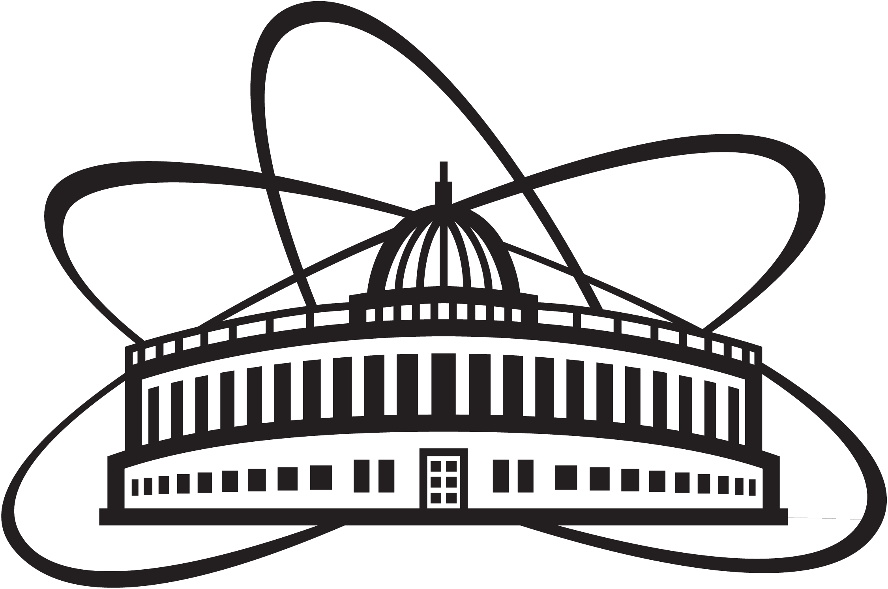
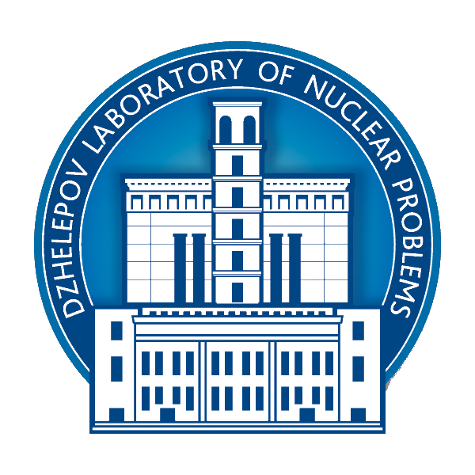
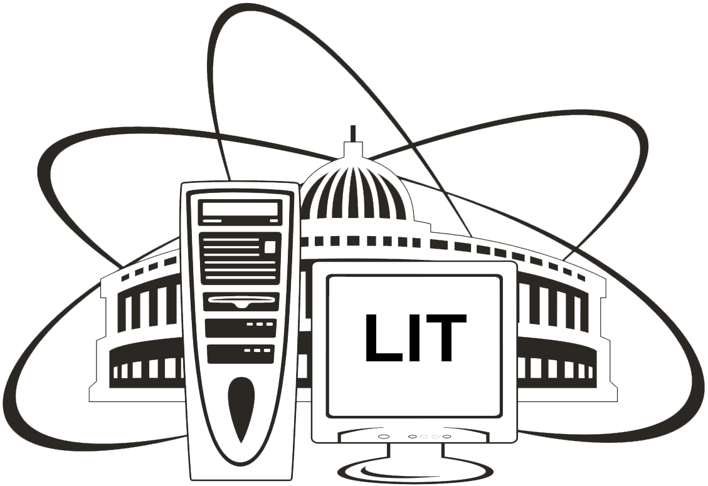
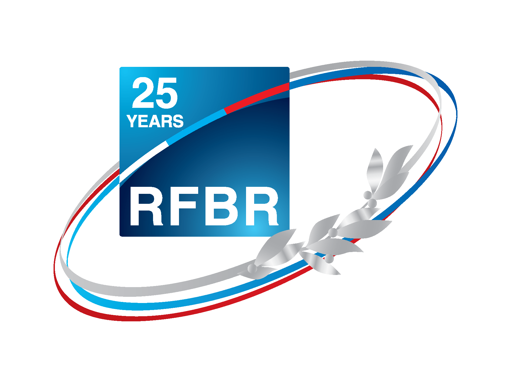
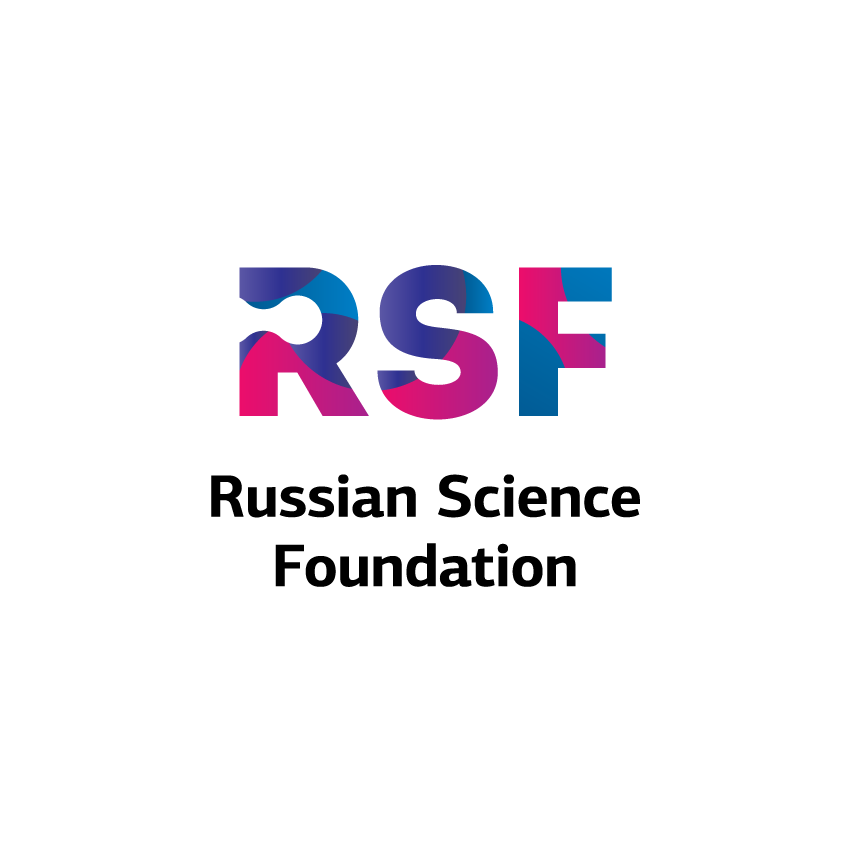
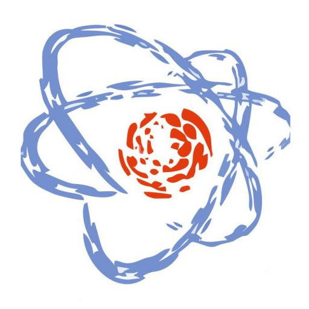
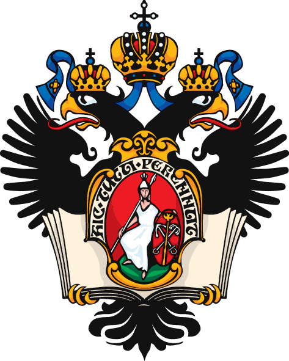
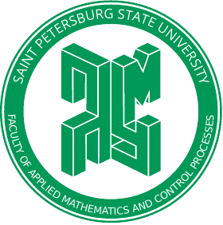
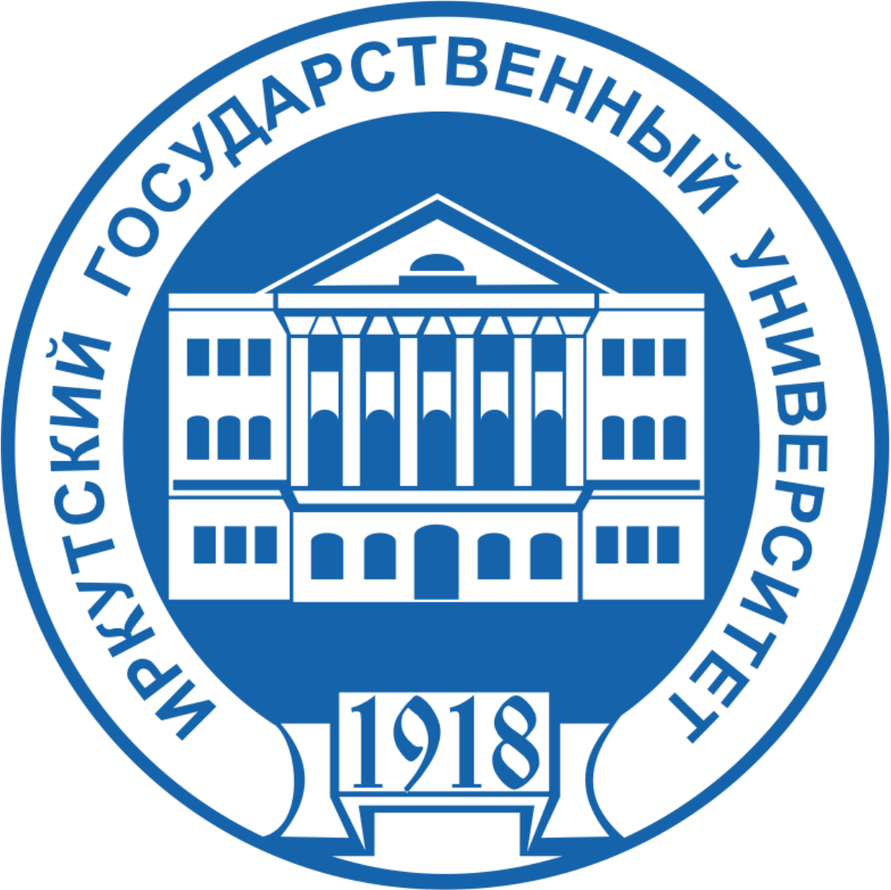

Acknowledgements
----------------

JINR
^^^^

.. list-table::
   :widths: 26 22 26
   :align: center

   * - |jinr|
     - |dlnp|
     - |lit|

The work on GNA is carried out by a group from Dzhelepov Laboratory of Nuclear Problems of Joint Institute for Nuclear
Problems. We are also grateful to the Laboratory of Information Technologies for their support.

Funding
^^^^^^^

.. list-table::
    :widths: 18 10 10
    :align: center

    * - |rsf|
      - |rfbr|
      - |ayss|

The GNA development is partially supported by the Russian Science Foundation (`RSCF <https://rscf.ru/en/>`_) under the grant agreement:
    - **21-42-00023**

Past grants
***********

The GNA development was partially supported by
    - Russian Foundation for Basic Research (`RFBR <http://www.rfbr.ru/rffi/eng>`_):
        * **14-02-91166 a**, 2014-2015
        * **16-02-01026 a**, 2016-2018
        * **16-32-00801 mol_a**, 2016
        * **18-32-00935 mol_a**, 2018-2019
    - Association of Young Scientists and Specialists of JINR (`AYSS <http://omus.jinr.ru>`_):
        * **14-202-02**, 2014
        * **15-202-04**, 2015
        * **17-202-09**, 2017
        * **18-202-08**, 2018
        * **21-202-10**, 2021

Universities
^^^^^^^^^^^^

.. list-table::
   :widths: 23 23 23 23
   :align: center

   * - |msu|
     - |mipt|
     - |spbu|
     - |isu|
     - |mipt|
   * - |msu-phys|
     - |dgap|
     - |spbu-apmath|
     - |isu-physdep|
     - |dgap|

Students and alumni of MSU, MIPT, SPBU and ISU have contributed to the development of GNA.
