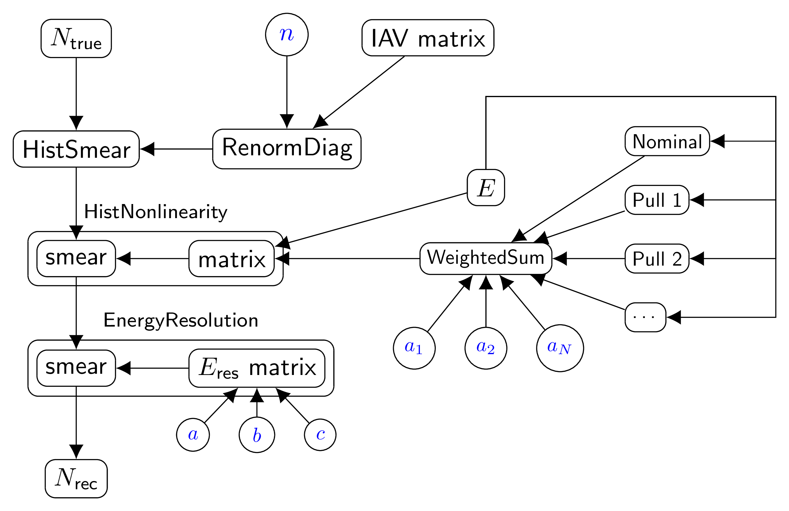

.. _bundlechain_v01:

Bundle chain (version 1)
^^^^^^^^^^^^^^^^^^^^^^^^

Overview
""""""""

The bundle represents a chain of transformations. The output of each transformation is connected to the input of the
next one.

Scheme
""""""

1. Create the namespace for each detector if needed.
2. For each bundle call ``execute_bundle()`` function passing common namespace, individual namespaces and the storage.
   The namespaces are populated by the parameters and transformations created by the nested bundles automatically.
3. For each detector chain the first output of each bundle to the first input of the next bundle.

The overall scheme of this bundle depends greatly on the provided configuration. An example scheme for the configuration
from Configuration_ section is shown below (excluding rebinner).

   The chain of the IAV, LSNL and energy resolution effects.

Configuration
"""""""""""""

The example configuration for three detectors and a chain of transformations that include the following bundles:

* :ref:`detector_iav_db_root_v01`,
* :ref:`detector_nonlinearity_db_root_v01`,
* :ref:`detector_eres_common3` and
* :ref:`rebin_bundle`.

For the description of the nested configuration, please refer to the relevant bundles.

.. code-block:: python

    cfg = NestedDict()
    cfg.detector = NestedDict(
            # the bundle name
            bundle = 'bundlechain_v01',
            # a list of detector names
            detectors = [ 'AD11', 'AD21', 'AD31' ],
            # a list of bundles
            chain = [ 'iav', 'nonlinearity', 'eres', 'rebin' ]
            )
    #
    # The following configuration is explained in the documentation for the relevant bundles.
    #
    cfg.detector.nonlinearity = NestedDict(
            bundle = 'detector_nonlinearity_db_root_v01',
            names = [ 'nominal', 'pull0', 'pull1', 'pull2', 'pull3' ],
            filename = 'output/detector_nl_consModel_450itr.root',
            uncertainty = 0.2*percent,
            uncertainty_type = 'relative'
            )
    cfg.detector.iav = NestedDict(
            bundle = 'detector_iav_db_root_v01',
            parname = 'OffdiagScale',
            uncertainty = 4*percent,
            uncertainty_type = 'relative',
            ndiag = 1,
            filename = 'data/dayabay/tmp/detector_iavMatrix_P14A_LS.root',
            matrixname = 'iav_matrix'
            )
    cfg.detector.eres = NestedDict(
            bundle = 'detector_eres_common3',
            # pars: sigma_e/e = sqrt( a^2 + b^2/E + c^2/E^2 ),
            values  = [ 0.014764, 0.0869, 0.0271 ],
            uncertainties = [30.0*percent]*3,
            uncertainty_type = 'relative'
            )
    cfg.detector.rebin = NestedDict(
            bundle = 'rebin',
            rounding = 3,
            edges = [ 0.0, 5.0, 10.0 ]
            )

Testing scripts
"""""""""""""""

.. code-block:: sh

    ../tests/bundle/detector_dbchain.py -s

