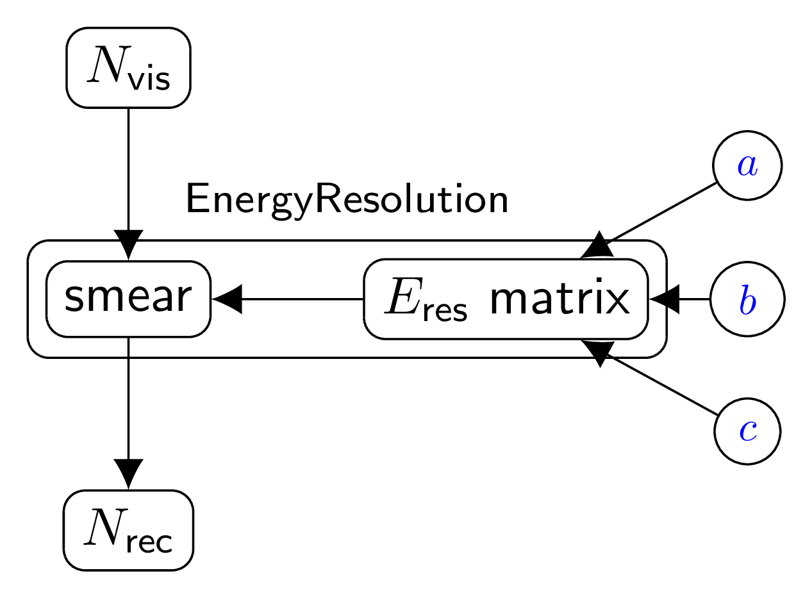

.. _detector_eres_common3:

detector_eres_common3 -- common energy resolution with 3 parameters (version 1)
^^^^^^^^^^^^^^^^^^^^^^^^^^^^^^^^^^^^^^^^^^^^^^^^^^^^^^^^^^^^^^^^^^^^^^^^^^^^^^^

Overview
""""""""

This class is a simple wrapper and configurator for the  :ref:`EnergyResolution` transformation. The energy resolution
parameters' uncertainties :math:`a`, :math:`b` and :math:`c` are considered to be uncorrelated between parameters and
fully correlated between detectors.

Scheme
""""""

1. Create  :ref:`EnergyResolution` instance. It will have as many inputs as the number of provided namespaces.
2. Create :math:`a`, :math:`b` and :math:`c` parameters in a common namespace.

   Energy resolution bundle scheme.

Parameters
""""""""""

:ref:`EnergyResolution` parameters :math:`a`, :math:`b` and :math:`c`.

Inputs, outputs and observables
"""""""""""""""""""""""""""""""

The bundle provides the input and output of the :ref:`EnergyResolution` by namespace name. The observable ``'eres'`` is
also defined for the corresponding namespace:

.. code-block:: python

    self.inputs[ns.name]              = eres.smear.Nvis
    self.outputs[ns.name]             = eres.smear.Nrec
    ns.addobservable('eres', eres.smear.Nrec, ignorecheck=True)

.. attention::

    When observable is added no check is perfomed whether the input is connected. The DataType and Data are not
    initialized.

Configuration
"""""""""""""

Optional options:
  - ``observable`` (bool or string). If provided, the observable is added for each output to th relevant namespace. If
    true the name 'eres' will be used.

.. code-block:: python

    cfg = NestedDict(
            # bundle name
            bundle = 'detector_eres_common3',
            # parameters a, b and c respectively for sigma_e/e = sqrt( a^2 + b^2/E + c^2/E^2 )
            pars = uncertaindict(
                # parameter values
                [('Eres_a', 0.014764) ,
                 ('Eres_b', 0.0869) ,
                 ('Eres_c', 0.0271)],
                # parameters uncertainty mode (absolute, relative or percent)
                mode='percent',
                # parameters uncertainty
                uncertainty=30
                )
            )

Testing scripts
"""""""""""""""

There is no individual testing script for  :ref:`detector_eres_common3`. Nevertheless it is included in the
:ref:`bundlechain_v01` testing script:

.. code-block:: sh

    tests/bundle/detector_dbchain.py -s

