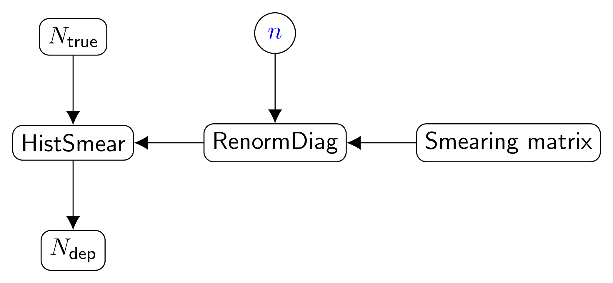

.. _detector_iav_db_root_v01:

Daya Bay IAV effect (version 1)
^^^^^^^^^^^^^^^^^^^^^^^^^^^^^^^

Overview
""""""""

The Daya Bay IAV effect is and effect due to particle energy loss in the Inner Acrylic Vessel (IAV). The total visible
energy is thus underestimated.

The IAV is and energy-resolution-like stochastic effect defined by smearing with an upper triangular matrix. The IAV
matrix is usually defined by MC simulation and thus is constant.

The systematic uncertainty of the IAV effect is caused by the IAV walls thickness variation and is uncorrelated between
the detectors. It's implemented by rescaling off-diagonal elements relative to the diagonal.

Scheme
""""""

1. Read the matrix from a ROOT file and store as  :ref:`Points <Points>`.
2. The output of :ref:`Points <Points>` is passed to the :ref:`RenormalizeDiag` instance. Since the uncertainty is
   uncorrelated between detectors an individual instance of :ref:`Points <Points>` is created for each input namespace.
   Variable :math:`n` is created in each namespace to represent off-diagonal scale (default :math:`n=1`).
3. The output with renormalized off-diagonal part is passed as smearing matrix to the  :ref:`HistSmear`.

All the transformations are configured to tread IAV matrix as upper triangular.

   IAV bundle scheme.

Parameters
""""""""""

1. Off-diagonal scale :math:`n` is created for each input namespace.

Configuration
"""""""""""""

.. code-block:: python

    cfg = NestedDict(
             # Bundle name
             bundle = 'detector_iav_db_root_v01',
             # Parameter name
             parname = 'OffdiagScale',
             # Parameter uncertainty and its type (absolute or relative)
             uncertainty = 4*percent,
             uncertainty_type = 'relative',
             # Number of diagonals to treat as diagonal. All other elements are considered as off-diagonal.
             ndiag = 1,
             # File name to read
             filename = 'data/dayabay/tmp/detector_iavMatrix_P14A_LS.root',
             # Matrix name
             matrixname = 'iav_matrix'
         )

Testing scripts
"""""""""""""""

.. code-block:: sh

    # For single detector case
    tests/bundle/iav.py -s
    # For two detectors case
    tests/bundle/iav2.py -s

