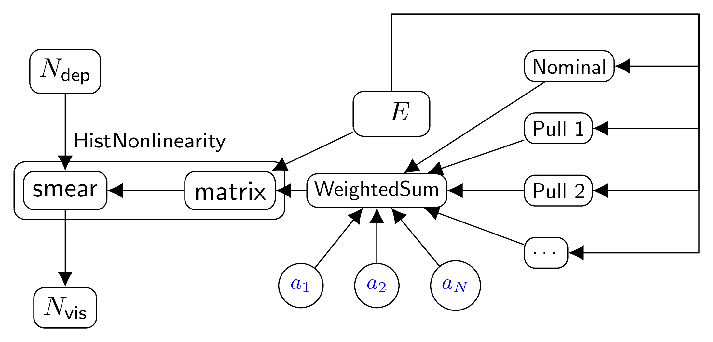

.. _detector_nonlinearity_db_root_v01:

detector_nonlinearity_db_root_v01 -- energyNonlinearity effect parametrization (version 1)
^^^^^^^^^^^^^^^^^^^^^^^^^^^^^^^^^^^^^^^^^^^^^^^^^^^^^^^^^^^^^^^^^^^^^^^^^^^^^^^^^^^^^^^^^^

Overview
""""""""

This bundle implements the Daya Bay type of the energy scale to be applied to a histogram. The correction includes:
1. Liquid scintillator non-linearity (LSNL) parametrization with uncertainties fully correlated between detectors.
2. Linear energy scale uncertainty, uncorrelated between detectors.

The bundle uses :ref:`HistNonlinearity` transformation.

Implementation
""""""""""""""

The Daya Bay energy nonlinearity is parametrized by the following formula:

.. math::
   \frac{E'}{E} = \delta_d\left( f_0(E) + \sum a_i \left( f_i(E) - f_0(E) \right) \right),

where :math:`\delta_d` defines the linear energy scale correction for each detector :math:`d`. The parameters
:math:`\delta_d=1` with uncertainty uncorrelated between parameters.

Function :math:`f_0(E)` is the nominal LSNL. The functions :math:`f_i(E)` represent the alternative LSNL curves chosen
in order to parametrize LSNL uncertainty with parameters :math:`a_i=0\pm1`. Parameters' :math:`a_i` uncertainties are
uncorrelated between parameters and fully correlated between detectors.

.. note::

    The current implementation of the bundle requireds input edges ``shared.edges`` to be provided within ``shared``
    constructor argument.

Scheme
""""""

1. A set of LSNL curves :math:`f_0` and :math:`f_i` are read from ROOT file. They are computed on a set of predefined
   histogram bin edges :math:`E` and summed together within  :ref:`WeightedSum` transformation. The :ref:`WeightedSums
   <WeightedSum>` weights representing parameters :math:`a_i` are created in a common namespace.

.. attention::

   The values of :math:`f_0(E)` and :math:`f_i(E)` are extrapolated for the whole range of :math:`E` if needed.

2. For each supplied namespace:

    a) Another :ref:`WeightedSum` instance is created with only parameter representing the correction :math:`1+\delta_d`.
    b) A :ref:`Product` instance is created to transform relative energy correction :math:`E'/E` to :math:`E'`.
    c) An instance of :ref:`HistNonlinearity` is created with :math:`E` and :math:`E'` as inputs.

   LSNL bundle scheme. The figure doesn't include items 2a and 2b.

Parameters
""""""""""

1. LSNL parameters :math:`a_i` in a common namespace by a number of correction LSNL curves.

2. Uncorrelated energy scale parameters :math:`\delta_d` for each supplied namespace.

Inputs, outputs and observables
"""""""""""""""""""""""""""""""

The bundle provides the input and output of the :ref:`HistNonlinearity` by namespace name. The observable
``'nonlinearity'`` is also defined for the corresponding namespace:

.. code-block:: python

    self.inputs[ns.name]  = nonlin.smear.Ntrue
    self.outputs[ns.name] = nonlin.smear.Nvis
    ns.addobservable('nonlinearity', nonlin.smear.Nvis, ignorecheck=True)

.. attention::

    When observable is added no check is perfomed whether the input is connected. The DataType and Data are not
    initialized.

Configuration
"""""""""""""

Optional options:
  - ``observable`` (bool or string). If provided, the observable is added for each output to th relevant namespace. If
    true the name 'nonlinearity' will be used.

.. code-block:: python

    cfg = NestedDict(
            # bundle name
            bundle = 'detector_nonlinearity_db_root_v01',
            # file to read
            filename = 'output/detector_nl_consModel_450itr.root',
            # TGraph names. First curve will be used as nominal
            names = [ 'nominal', 'pull0', 'pull1', 'pull2', 'pull3' ],
            # The uncorrelated energy scale uncertainty type (absolute/relative/percent)
            par = uncertain(1.0, 0.2, 'percent'),
            # The parameter name to use for storage
            parname = 'escale',
            )

``parname`` may optionally contain a formatting directive ('escale.{}'). '{}' will be replaced with namespace
(detector) name. Period '.' is interpreted as nesting, i.e. bundle will created new namespace ``'escale'`` and
collect all the parameters within.

Testing scripts
"""""""""""""""

.. code-block:: sh

    # For single detector case
    tests/bundle/detector_nl.py -s
    # For two detectors case
    tests/bundle/detector_nl_2.py -s

