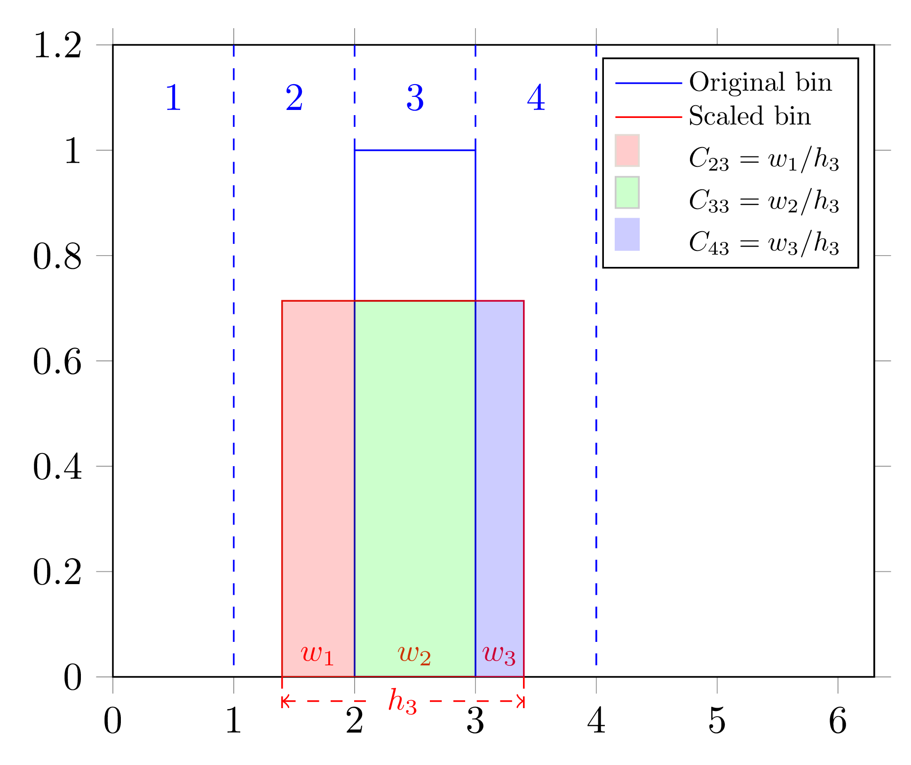

HistNonlinearity
~~~~~~~~~~~~~~~~

Description
^^^^^^^^^^^
Simulates the effect of the x-axis scale distortion, usually non-linear. It is deterministic effect. May be used for
example to simulate energy non-linearity effect.

HistNonlinearity_ contains two transformations:

1) Matrix_ transformation, that calculates 'smearing' matrix for given distortion.
2) Smear_ transformation, that actually applies the smearing matrix.

Inputs
""""""

1. ``'smear.NonlinearityMatrix'`` —­square smearing matrix of number of events :math:`C`.
2. ``'smear.Ntrue'`` — one-dimensional histogram of number of events :math:`N_{\text{true}}`.

Outputs
"""""""

1. ``'smear.Nvis'`` — one-dimensional smeared histo of number of events :math:`N_{\text{vis}}`

Arguments
"""""""""

1. ``bool upper``. If true HistNonlinearity_ will ensure that the matrix is upper diagonal. 
   Useful for the cases of energy leak type smearing.

Implementation
""""""""""""""

   An illustration of HistNonlinearity_ applied to a single bin.

