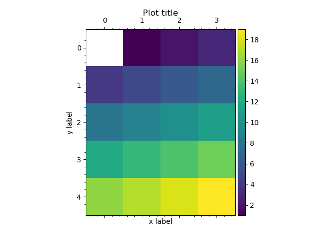

Tutorial (Under construction)
-----------------------------

Introduction
^^^^^^^^^^^^

GNA provides a way to build a numerical model as lazy evaluated computational graph. The nodes of a graph represent
functions and are called transformations. The transformations produce few return arrays, called outputs, and may have
arguments, called inputs. Outputs of transformations may be connected to inputs of other transformations. They all are
represented by the graph edges.

The data is allocated on the transformations' outputs while inputs are simple views on the relevant data.

Transformations may depend on a number of variables.

The main object in GNA is ``GNAObject`` which holds the following information:
    1. A list of transformations, accessible by name or by index.
    2. A list of variables the transformations depend on.

The typical syntax includes:

.. code-block:: python
    :linenos:

    # Create GNAObject holding some transformations
    obj = SomeGNAObject()

    # There are several ways to access the transformation 'tname' from obj
    # 1. By keyword from a dictionary
    trans = obj.transformrations['tname']
    # 2. By attribute (syntactic sugar for 1.)
    trans = obj.transformrations.tname
    # 3. By index from a dictionary
    trans = obj.transformrations[0]
    # 4. Or even more shorter versions or 2.
    trans = obj['tname']
    trans = obj.tname

    # Similar ways are available for accessing transfromations' outputs
    out = trans.outputs['oname']
    out = trans.outputs.oname
    out = trans.outputs[0]
    # The short ways are only valid in case there are no inputs with name 'oname'
    out = trans['oname']
    out = trans.oname

    # Similar ways are available for accessing transfromations' inputs
    inp = trans.inputs['iname']
    inp = trans.inputs.iname
    inp = trans.inputs[0]
    # The short ways are only valid in case there are no outputs with name 'iname'
    inp = trans['iname']
    inp = trans.iname

.. note:: Any ambiguity will trigger the exception. For example, if transformation has input and output with similar
          name `thename`, shortcut :code:`trans.thename` is forbidden.

Let us no see the actual code examples.

Utilites
^^^^^^^^

GNA contains a set of helper tools to simplify calling C++ functions from python. The :ref:`Constructors` module contain
wrappers for often used C++ classes' enabling the user to pass numpy arrays and python lists. The following code
converts the python list of strings to ``std::vector<std::string>``:

.. literalinclude:: ../../macro/tutorial/basic/00_stdvector.py
    :linenos:
    :lines: 4-
    :emphasize-lines: 3
    :caption: :download:`00_stdvector.py <../../macro/tutorial/basic/00_stdvector.py>`

The code produces the following output:

.. code-block:: txt
    :linenos:

    <ROOT.vector<string> object at 0x55b4546e8be0>, ['str1', 'str2', 'str3']

GNA introduces convenience pythonic methods for its types that may be loaded as follows:

.. code-block:: python

    from gna.bindings import common

They include the methods for printing and plotting with matplotlib.

Simple transformations
^^^^^^^^^^^^^^^^^^^^^^

Here we will review several simple transformations. Simple means that they do not depend on any variables and have no
inputs. There are currently three transformations `Points`, `Histogram` and `Histogram2d` that enable user to initialize
the input data (arrays or histograms) in forms of transformation outputs.

Points
""""""

The :ref:`Points <Points>` transformation is used to represent 1d/2d array as transformation output. The ``Points``
instance is created with ``numpy`` array passed as input:

.. literalinclude:: ../../macro/tutorial/basic/01_points.py
    :linenos:
    :lines: 4-
    :emphasize-lines: 7,12,14,16
    :caption: :download:`01_points.py <../../macro/tutorial/basic/01_points.py>`

The code produces the following output:

.. code-block:: txt
    :linenos:

    Output: [out] points: array 2d, shape 3x4, size  12
    DataType: array 2d, shape 3x4, size  12
    Data:
     [[ 0.  1.  2.  3.]
     [ 4.  5.  6.  7.]
     [ 8.  9. 10. 11.]]

Histogram
"""""""""

The :ref:`Histogram` transformation stores a 1-dimensional histogrammed data. It is very similar to the 1d version of
`Points` with the only difference: its DataType stores the bin edges.

.. literalinclude:: ../../macro/tutorial/basic/02_hist.py
    :linenos:
    :lines: 4-
    :emphasize-lines: 12,17,20,21,23
    :caption: :download:`02_hist.py <../../macro/tutorial/basic/02_hist.py>`

On line 21 `datatype.edges` C++ vector is converted to to the python list.

The code produces the following output:

.. code-block:: txt
    :linenos:

    Output: [out] hist: hist,  12 bins, edges 1.0->7.0, width 0.5
    DataType: hist,  12 bins, edges 1.0->7.0, width 0.5
    Bin edges: [1.0, 1.5, 2.0, 2.5, 3.0, 3.5, 4.0, 4.5, 5.0, 5.5, 6.0, 6.5, 7.0]
    Data: [  0. 100. 324. 576. 784. 900. 900. 784. 576. 324. 100.   0.]

Histogram2d
"""""""""""

The :ref:`Histogram2d <Histogram2d>` is 2-dimensional version of a histogram. It holds the 2-dimensional array and its
datatype has two sets of bin edges.

.. literalinclude:: ../../macro/tutorial/basic/03_hist2d.py
    :linenos:
    :lines: 4-
    :emphasize-lines: 14,19,22-24,26
    :caption: :download:`03_hist2d.py <../../macro/tutorial/basic/03_hist2d.py>`

The code produces the following output:

.. code-block:: txt
    :linenos:

    Output: [out] hist: hist2d, 12x8=96 bins, edges 0.0->12.0 and 0.0->8.0
    DataType: hist2d, 12x8=96 bins, edges 0.0->12.0 and 0.0->8.0
    Bin edges (X): [0.0, 1.0, 2.0, 3.0, 4.0, 5.0, 6.0, 7.0, 8.0, 9.0, 10.0, 11.0, 12.0]
    Bin edges (Y): [0.0, 1.0, 2.0, 3.0, 4.0, 5.0, 6.0, 7.0, 8.0]
    Data: [[      0.    8836.   34596.   76176.  132496.  202500.  285156.  379456.]
     [ 484416.  599076.  722500.  853776.  992016. 1136356. 1285956. 1440000.]
     [1597696. 1758276. 1920996. 2085136. 2250000. 2414916. 2579236. 2742336.]
     [2903616. 3062500. 3218436. 3370896. 3519376. 3663396. 3802500. 3936256.]
     [4064256. 4186116. 4301476. 4410000. 4511376. 4605316. 4691556. 4769856.]
     [4840000. 4901796. 4955076. 4999696. 5035536. 5062500. 5080516. 5089536.]
     [5089536. 5080516. 5062500. 5035536. 4999696. 4955076. 4901796. 4840000.]
     [4769856. 4691556. 4605316. 4511376. 4410000. 4301476. 4186116. 4064256.]
     [3936256. 3802500. 3663396. 3519376. 3370896. 3218436. 3062500. 2903616.]
     [2742336. 2579236. 2414916. 2250000. 2085136. 1920996. 1758276. 1597696.]
     [1440000. 1285956. 1136356.  992016.  853776.  722500.  599076.  484416.]
     [ 379456.  285156.  202500.  132496.   76176.   34596.    8836.       0.]]

Plotting outputs via matplotlib
^^^^^^^^^^^^^^^^^^^^^^^^^^^^^^^

GNA defines a set of convenience methods to plot the transformation outputs with matplotlib. The methods are wrappers
for regular `matplotlib <https://matplotlib.org/api/pyplot_api.html>`_ commands. For the complete matplotlib
documentation please refer the official `site <https://matplotlib.org/api/pyplot_api.html>`_.

Plotting arrays (1d)
""""""""""""""""""""

A ``plot(...)`` method is defined implementing
`plot(y, ...) <https://matplotlib.org/api/pyplot_api.html#matplotlib.pyplot.plot>`_ call passing output contents as `y`.
The method works the same way for both arrays and histograms.

.. literalinclude:: ../../macro/tutorial/basic/04_points_plot.py
    :linenos:
    :lines: 4-31,38
    :emphasize-lines: 25,26
    :caption: :download:`04_points_plot.py <../../macro/tutorial/basic/04_points_plot.py>`

When 1d array is passed (line 25) it is plotted as is while for 2d array (line 6) each column is plotted in separate.
The latter produces the blue line on the following figure while the former produces orange, green and red lines.

.. figure:: ../img/tutorial/04_points_plot.png

    A example ``output.plot()`` method for outputs with 1d and 2d arrays.

.. table:: Keyword options

    +------------------+---------------------------------+
    | `transpose=True` | transpose array before plotting |
    +------------------+---------------------------------+

Plotting arrays vs other arrays (1d)
""""""""""""""""""""""""""""""""""""

If `X` vs `Y` is desired ``output_y.plot_vs(output_x, ...)`` syntax may be used. Matplotlib
`plot(x, y, ...) <https://matplotlib.org/api/pyplot_api.html#matplotlib.pyplot.plot>`_ function is used.

The twin method ``output_x.vs_plot(output_y, ...)`` may be used in case reversed order is desired.

.. literalinclude:: ../../macro/tutorial/basic/05_points_plot_vs.py
    :linenos:
    :lines: 4-27,34
    :emphasize-lines: 22
    :caption: :download:`05_points_plot_vs.py <../../macro/tutorial/basic/05_points_plot_vs.py>`

.. figure:: ../img/tutorial/05_points_plot_vs.png

    A example ``output_x.plot_vs(output_y)`` method for outputs.

.. table:: Keyword options

    +------------------+----------------------------------+
    | `transpose=True` | transpose arrays before plotting |
    +------------------+----------------------------------+

Plotting matrices as colormaps
""""""""""""""""""""""""""""""

The
A ``matshow(...)`` method is defined implementing
`matshow(A, ...) <https://matplotlib.org/api/pyplot_api.html#matplotlib.pyplot.matshow>`_ call passing output contents as `A`.
This method works with both histograms and arrays. When applied to histograms it ignores bin edges definitions and plots
the matrix anyway.

.. literalinclude:: ../../macro/tutorial/basic/06_matshow.py
    :linenos:
    :lines: 4-25,31
    :emphasize-lines: 21
    :caption: :download:`06_matshow.py <../../macro/tutorial/basic/06_matshow.py>`

    A example ``output2d.matshow()`` method for outputs.

.. table:: Keyword options

    +------------------+--------------------------------------------------------------------------------------+
    | `colorbar=True`  | add a colorbar                                                                       |
    +------------------+--------------------------------------------------------------------------------------+
    | `mask`           | do not colorize values, equal to `mask`. `mask=0.0` will produce ROOT-like colormaps |
    +------------------+--------------------------------------------------------------------------------------+
    | `transpose=True` | transpose arrays before plotting                                                     |
    +------------------+--------------------------------------------------------------------------------------+

.. note::

    Unlike in matplotlib ``output.matshow()`` will not create extra figure by default. See `fignum` option description
    in `matshow() <https://matplotlib.org/api/pyplot_api.html#matplotlib.pyplot.matshow>`_ documentation.

Compound transformaions
^^^^^^^^^^^^^^^^^^^^^^^

Sum
"""

Product
"""""""

Variables
^^^^^^^^^

Defining variables
""""""""""""""""""

WeightedSum transformation
""""""""""""""""""""""""""

Interpolation
^^^^^^^^^^^^^

Integration
^^^^^^^^^^^

