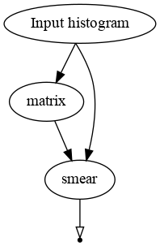
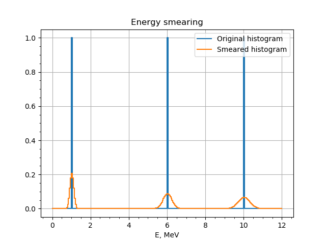
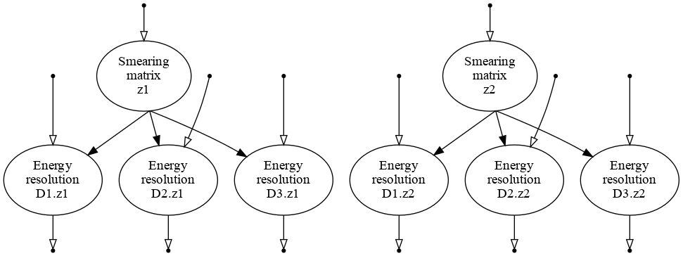
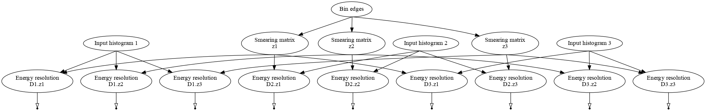
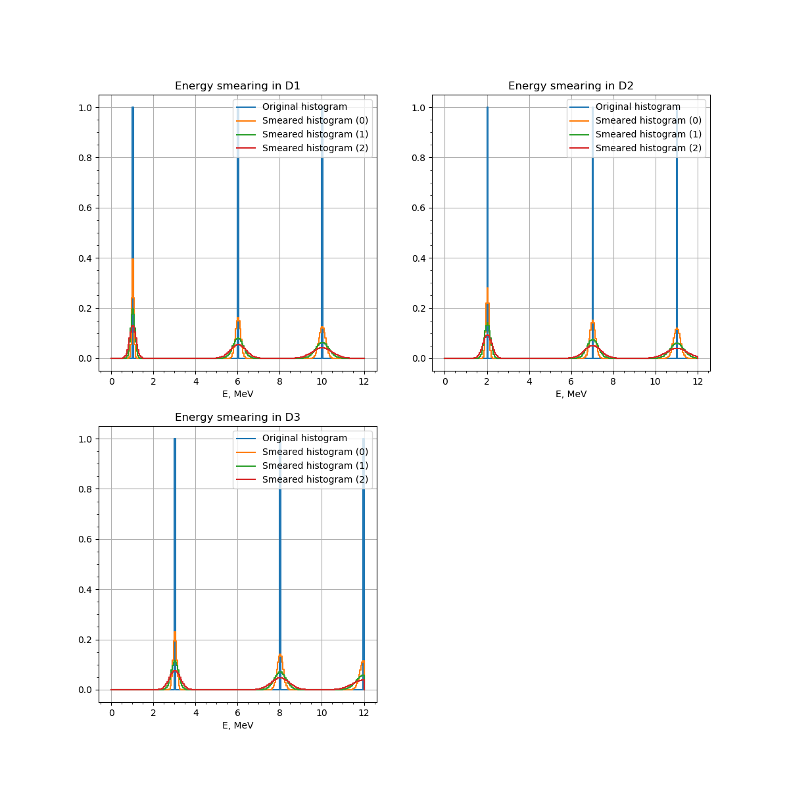
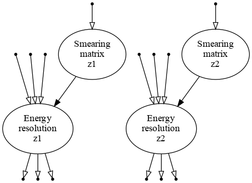
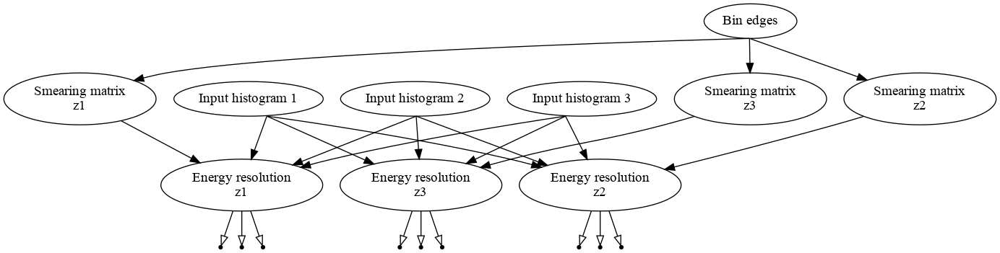

Replicating graphs
''''''''''''''''''

Now let us learn the second capability of the bundles: graph generation and replication. We will use the example of the
:ref:`energy resolution transformation<EnergyResolution>`. In short, the energy resolution transformation smears the
input histogram bin by bin. Each bin is smeared with a Gaussian. A width is defined based on the bin center by a
formula, that depends on three parameters: :math:`a`, :math:`b` and :math:`c`.

The energy resolution object contains 2+ transformations: `matrix` transformation computes the smearing matrix based on
the values of the parameters, at least one `smear` transformation smears the input histogram with smearing matrix.

We now will define a bundle which:

#. Defines the parameters for :math:`a`, :math:`b` and :math:`c`.

   + If major index is specified, different parameters are defined for each iteration.
   + Minor indices are ignored.

#. Defines the energy resolution object for each major iteration.

   + The `matrix` transformation depends on the current parameters :math:`a`, :math:`b` and :math:`c`.
     The bundle provides an input of the `matrix` transformation for each major iteration. The bin edges output should
     be connected to it.
   + New `smear` transformation is added for each minor iteration.
   + The bundle provides an input/output pair on each minor+major iteration.

#. Optional features:

   + Label formats.
   + Merge transformations. Do not create a new transformation for each minor index. Use the same transformation to
     process all the inputs. The procedure is explained :ref:`here <tutorial_topology>`.

Energy resolution bundle
++++++++++++++++++++++++

At first let us create a draft bundle `detector_eres`.

.. literalinclude:: ../../../macro/tutorial/bundles/detector_eres_ex01.py
    :linenos:
    :lines: 4-
    :emphasize-lines: 16,21,28,29
    :caption: :download:`detector_eres_ex01.py <../../../macro/tutorial/bundles/detector_eres_ex01.py>`

The method `define_variables()` is called to define th variables similarly to the :ref:`tutorial on a bundle for
parameters <tutorial_parameters_replication>`. The only difference is that for each major iteration there are three
parameters to be defined. An extra check is done that the actual parameter names for each major iteration is the same.

Let us now look at the second method `build()` that creates a part of the computational graph.

.. literalinclude:: ../../../macro/tutorial/bundles/detector_eres_ex01.py
    :linenos:
    :lines: 13-32
    :emphasize-lines: 7,12,19,20

We start from iterating over major indices combinations:

.. literalinclude:: ../../../macro/tutorial/bundles/detector_eres_ex01.py
    :linenos:
    :lines: 13-17

On each iteration we make a list of parameter names to be passed to the energy resolution constructor

.. literalinclude:: ../../../macro/tutorial/bundles/detector_eres_ex01.py
    :linenos:
    :lines: 19

The namespace is passed to ensure that energy resolution refers to the correct parameters. Here is the contents of the
`EnergyResolution` object:

.. code-block:: text

    [obj] EnergyResolution: 2 transformation(s), 3 variables
     0 [trans] matrix: 1 input(s), 1 output(s)
         0 [in]  Edges <- ...
         0 [out] FakeMatrix: invalid
     1 [trans] smear: 2 input(s), 1 output(s)
         0 [in]  FakeMatrix <- [out] FakeMatrix: invalid
         1 [in]  Ntrue <- ...
         0 [out] Nrec: invalid

As one can see and as described in :ref:`EnergyResolution` we need to bind a histogram that defines the bin edges to
`matrix.Edges` and a histogram that will be smeared to the `smear.Ntrue`. Since the aim of the current bundle is not to
bind the inputs and outputs, but rather to provide them to later use we declare the output with the following command:

.. literalinclude:: ../../../macro/tutorial/bundles/detector_eres_ex01.py
    :linenos:
    :lines: 24

The signature is `set_input('name', nidx, input, argument_number)`. The output will be located in the
`bundle.context.inputs.eres_matrix`. The full path after `bundle.context.inputs` will be defined by the major index
current format. Argument number will be added in the end of the path. It is used in case several inputs are used for the
same name.

We then iterate over each minor index,

.. literalinclude:: ../../../macro/tutorial/bundles/detector_eres_ex01.py
    :linenos:
    :lines: 26-32
    :emphasize-lines: 6-7

add a new input/output pair and declare the input/output pair with methods `set_input()` and `set_output()`.

Now let us use the bundle in the following script:

.. literalinclude:: ../../../macro/tutorial/bundles/05_bundle_eres.py
    :linenos:
    :lines: 4-
    :caption: :download:`05_bundle_eres.py <../../../macro/tutorial/bundles/05_bundle_eres.py>`

The configuration and execution should be familiar to the use after :ref:`tutorial on a bundle for parameters
<tutorial_parameters_replication>`. The loaded parameters are the following:

.. code-block:: text

    Variables in namespace 'eres':
      a                    =       0.01 │        0.01±       0.003 [         30%] │
      b                    =       0.09 │        0.09±       0.027 [         30%] │
      c                    =       0.03 │        0.03±       0.009 [         30%] │

After executing the bundle let us make an input:

.. literalinclude:: ../../../macro/tutorial/bundles/05_bundle_eres.py
    :linenos:
    :lines: 40-48

Here we defined a histogram for energy between 0 and 12 MeV with three peaks: at 1 MeV, 6 MeV and 10 MeV. The histogram
output is then bound to the inputs as follows:

.. literalinclude:: ../../../macro/tutorial/bundles/05_bundle_eres.py
    :linenos:
    :lines: 52-54

The last line prints the contents of the context:

.. code-block:: text

    ${
      inputs : ${
        eres_matrix : ${
          00 : [in]  Edges <- [out] hist: hist, 240 bins, edges 0.0->12.0, width 0.05,
        },
        eres : ${
          00 : [in]  Ntrue <- [out] hist: hist, 240 bins, edges 0.0->12.0, width 0.05,
        },
      },
      objects : ${},
      outputs : ${
        eres_matrix : [out] FakeMatrix: array 2d, shape 240x240, size 57600,
        eres : [out] Nrec: hist, 240 bins, edges 0.0->12.0, width 0.05,
      },
    }

Context is a nested dictionary with declared inputs `eres_matrix.00` and `eres.00`. The outputs contain outputs
`eres_matrix` and `eres`. Just as it was declared in the bundle for the case with empty major iterator. When binding we
have used `.values()` method that returns an iterator on all the values to avoid typing `00`.

When empty multi-index is provided the resulting graph looks as follows:

    The resulting graph of the energy resolution bundle for the case of empty index.

It contains the `matrix` transformation, which is defined by the histogram binning. The matrix is then used to smear the
histogram via `smar` transformation. As it is noted in the  :Ref:`EnergyResolution`, the input of the `matrix` is used
only to define the matrix shape: it does not read the histogram and does not propagate the taint flag.

The example produces the following plot:

    A histogram with bins at 1 MeV, 6 MeV and 10 MeV smeared with  :Ref:`EnergyResolution` bundle.

Energy resolution replicated
++++++++++++++++++++++++++++

Before trying more complex example, we add some new features to the `detector_eres` bundle. We change the version mark
to `ex02` to keep both versions available. The updates include:

#. A method to label transformations and parameters based on the configuration.
#. Option `split_transformations` (true by default) which changes the graph topology.

The newer version is available in :download:`detector_eres_ex02.py <../../../macro/tutorial/bundles/detector_eres_ex02.py>`.

Here is a script:

.. literalinclude:: ../../../macro/tutorial/bundles/05_bundle_eres_upd.py
    :linenos:
    :lines: 4-
    :caption: :download:`05_bundle_eres_upd.py <../../../macro/tutorial/bundles/05_bundle_eres_upd.py>`

Let us look at the configuration in more details. First of all we defined indices.

.. literalinclude:: ../../../macro/tutorial/bundles/05_bundle_eres_upd.py
    :linenos:
    :lines: 20-22

We assume that there are three detectors `D1`, `D2` and `D3` with same energy resolution parameters. In the same time,
each of the detectors has two zones `z1` and `z2` with own parameters. The zone index `z` is thus major while the
detector index `d` is minor. The parameters configuration contains a value and uncertainty for each of the parameters
:math:`a`, :math:`b` and :math:`c` for each of the zones.

.. literalinclude:: ../../../macro/tutorial/bundles/05_bundle_eres_upd.py
    :linenos:
    :lines: 28-40

One may see that there are parameters for more zones in the configuration, but only ones, defined by indices, will be
read.

Also, the bundle normally defines input/output pairs for `eres` and `eres_matrix`. These names may be overridden via
dictionary `names` in the bundle configuration:

.. literalinclude:: ../../../macro/tutorial/bundles/05_bundle_eres_upd.py
    :linenos:
    :lines: 23-25

Here we have defined a new name `smearing_matrix` for the `eres_matrix`. Name substitutions are realized by the GNA.

By using `labels` we now define the labels for `matrix` and `smear` transformations and for the parameters. The format
strings include the field `{autoindex}` that will be substituted by the current iteration of the multi-index. There is
also `{description}` field, that will be substituted by the parameter meaning. The labels are set by the `detector_eres`
bundle of version `ex02`.

Executing the bundle we produce the following graph:

    The resulting graph of the energy resolution bundle (version `ex02`). Inputs are open.

As one may see, there are two smearing matrices, one for each zone. The matrices are similar between the detectors.

The parameters are defined for each of the zones:

.. code-block:: text

    Variables in namespace 'eres.z1':
      a                    =          0 │                 [fixed]                 │ spatial/temporal resolution (zone z1)
      b                    =       0.05 │        0.05±       0.015 [         30%] │ photon statistics (zone z1)
      c                    =          0 │                 [fixed]                 │ dark noise (zone z1)
    Variables in namespace 'eres.z2':
      a                    =          0 │                 [fixed]                 │ spatial/temporal resolution (zone z2)
      b                    =        0.1 │         0.1±        0.03 [         30%] │ photon statistics (zone z2)
      c                    =          0 │                 [fixed]                 │ dark noise (zone z2)

We now define input histograms in the same way as we done in the previous example with the only difference. There is now
a separate histogram for each detector with the peaks in the different positions.

.. literalinclude:: ../../../macro/tutorial/bundles/05_bundle_eres_upd.py
    :linenos:
    :lines: 57-82

We bind the first histogram to the `matrix` input. Each histogram `hist1`, `hist2` and `hist3` is the binded to all the
inputs of detectors `D1`, `D2` and `D3` respectively.

.. literalinclude:: ../../../macro/tutorial/bundles/05_bundle_eres_upd.py
    :linenos:
    :lines: 90-93

We have used `nestsed=True` key that returns all the values in all the nested dictionaries regardless of the structure.
The full graph now looks as follows:

    The resulting graph of the energy resolution bundle (version `ex02`). Inputs are bound.

And the result of the smearing plotted:

    Three histograms (`D1`, `D2` and `D3`) smeared with two smear matrices each (`z1` and `z2`).

Energy resolution replicated (and merged)
+++++++++++++++++++++++++++++++++++++++++

The computational chain topology is discussed in tutorial :ref:`tutorial_topology`. The `detector_eres` bundle has
parameter `split_transformations`, which is by default `True`. This means that each minor iteration produces an input in
a new transformation: each input taintflag is propagated in separate. If `split_transformations` is set to `False`, all
the inputs for the same major iteration are handled by the same transformation as shown in the following graph.

    The resulting graph of the energy resolution bundle (version `ex02`) with `split_transformations=False`. Inputs are
    open.

When the histograms are bound to the inputs, the graph looks as follows:

    The resulting graph of the energy resolution bundle (version `ex02`) with `split_transformations=False`. Inputs are
    bound.
