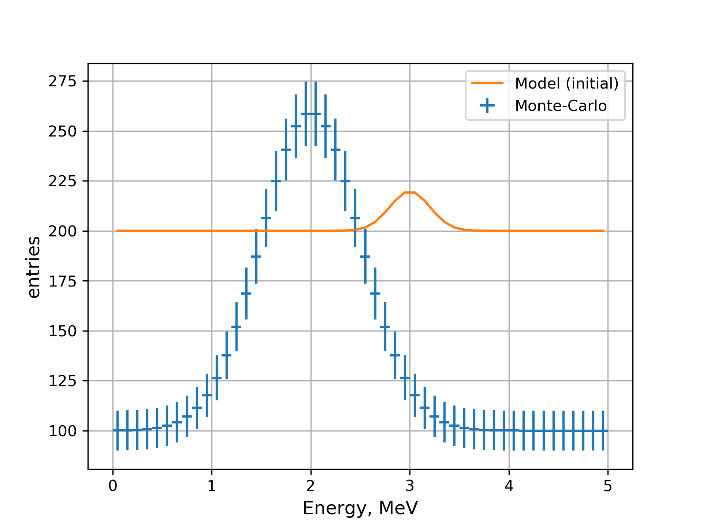

.. _fitting_asimov:

Fitting to Asimov dataset
"""""""""""""""""""""""""

Let us now construct an example setup for fitting. We will use `gaussianpeak` module to provide both the data and the
model to be fit.

At first, we initialize two `gaussianpeak` modules with names `peak_MC` and `peak_f`. The former will be used as data
while the latter will be used as a model to be fit.

.. literalinclude:: ../../../macro/tutorial/fit/01_fit_script.sh
    :linenos:
    :lines: 3-5
    :caption: :download:`01_fit_script.sh <../../../macro/tutorial/fit/01_fit_script.sh>`

Now, using `ns` module we change the parameters for the models:

.. literalinclude:: ../../../macro/tutorial/fit/01_fit_script.sh
    :linenos:
    :lines: 6-15

Here we have used slightly different approach to the parameters. Instead of defining the parameters prior the models, we
change them after the module creates the default versions. Syntax of the :code:`--set` option is pretty similar to the
one of the :code:`--define`.

This command line produces the following output:

.. literalinclude:: ../../img/tutorial/fit/01_fit_models.out
    :linenos:
    :lines: 3-14

Next step is to define the Datasets and Analysis instances. Both of them should have unique name defined. Names should
be unique across the similar modules: all datasets should have unique names and all analysis should have unique names,
there still may exist a dataset and an analysis with the same name.

The Dataset is defined by the `dataset` module.

.. literalinclude:: ../../../macro/tutorial/fit/01_fit_script.sh
    :lines: 16

We have just created dataset `peak`, that makes a correspondence between the output `peak_f/spectrum` and output
`peak_MC/spectrum` (data). The option :code:`--asimov-data` indicates that `peak_MC` will have no fluctuations added.

In addition to data and theory outputs dataset defines statistical uncertainties. They are optional in a sense, that
they may be used by the static, for example by :math:`\chi^2` function. In case log-Poisson is used the statistical
uncertainties defined in data set will be ignored.

.. attention::

    By default Pearson's definition for statistical uncertainties is used: For each bin :math:`i`
    :math:`\sigma_\text{stat}=\sqrt{N_i}`, where :math:`N_i` comes from theory. Therefore statistical uncertainties
    depend on the actual parameter values used for the theory at the current step.

    Statistical uncertainties output is frozen and will not be updated when minimizer will change the parameters.

In case of a single Asimov dataset the Analysis definition is straightforward:

.. literalinclude:: ../../../macro/tutorial/fit/01_fit_script.sh
    :lines: 17

Here we define Analysis, named `analysis`, which is using a single dataset `peak`. The analysis now may be used to
define the statistics. Let us use the :math:`\chi^2` statistics:

.. literalinclude:: ../../../macro/tutorial/fit/01_fit_script.sh
    :lines: 19

The syntax is similar. The module `chi2` defines the :math:`\chi^2` statistics with name `stats_chi2` and assigns it to
the analysis `analysis`.

In order to create the minimizer one needs to define its name, type, statistics and a set of parameters to minimize.
Parameters may be defined either as a list of parameter names or the namespace names. All the parameters from the
namespaces, mentioned in the command, will be used for minimization.

.. literalinclude:: ../../../macro/tutorial/fit/01_fit_script.sh
    :lines: 25

Here we define the minimizer `min`, which will use ROOT's Minuit to minimize the statistics `stats_chi2`, which depends
on the parameters, listed in the namespace `peak_f`.

For the illustration purpose let us now change the parameters for the minimization:

.. literalinclude:: ../../../macro/tutorial/fit/01_fit_script.sh
    :lines: 20-24

Now we may plot the data and initial state of the model with the following command line:

.. literalinclude:: ../../../macro/tutorial/fit/01_fit_script.sh
    :lines: 26-28

   MC data defined by the model `peak_MC` and initial state of the model `peak_f`.

The `minimizer` module only creates minimizer, but does not use it for the minimization. It may then be used from other
modules to find a best fit, estimate confidence intervals, etc. The fitting may be invoked from the `fit` module:

.. literalinclude:: ../../../macro/tutorial/fit/01_fit_script.sh
    :lines: 29

This simple module performs a fit, prints the result to standard output (:code:`-p` option) and saves it to the output
file (:code:`-o` option). After the minimization is done, the best fit values, estimated uncertainties, function at the
minimum are printed as well as some usage statistics.

.. literalinclude:: ../../img/tutorial/fit/01_fit_models.out
    :linenos:
    :lines: 22-49
    :emphasize-lines: 3,12,19

The minimizer takes care so that original values of the parameters were restored after the minimization process.

Extra option :code:`-s`/:code:`--set` makes fitter to set the best fit values to the model, unless the fit failed.
Now we can plot the state of the fit model.

.. literalinclude:: ../../../macro/tutorial/fit/01_fit_script.sh
    :lines: 31-

The `ns` module prints the current and default values of the parameters to the output:

.. literalinclude:: ../../img/tutorial/fit/01_fit_models.out
    :lines: 51-55

The result of the fitting is:

.. figure:: ../../img/tutorial/fit/01_fit_models_fit.png
   :align: center

   MC data defined by the model `peak_MC` and best fit state of the model `peak_f`.

As soon as the model contains no fluctuations, the function at the minimum is consistent with zero:
:math:`\chi^2_\text{min}\lesssim10^{-8}`.

Also, the `fit` module have saved readable version of the result to the file :download:`fit_01.yaml
<../../img/tutorial/fit/fit_01.yaml>` in the YAML format, which can be later loaded back into python.

The full version of the command is below:

.. literalinclude:: ../../../macro/tutorial/fit/01_fit_script.sh
    :linenos:
    :caption: :download:`01_fit_script.sh <../../../macro/tutorial/fit/01_fit_script.sh>`

Saving fit result to other formats
''''''''''''''''''''''''''''''''''

The result may be saved to the `pickle <https://docs.python.org/2/library/pickle.html>`_ binary format. In order to
achieve this the output extension should be set to `.pkl`:

.. code-block:: bash

    ... \
    -- fit min -s -p -o output/fit_01.pkl \
    ... \

The `-o` option accepts multiple arguments, so the output may be saved into multiple files:

.. code-block:: bash

    ... \
    -- fit min -s -p -o output/fit_01.pkl output/fit_01.yaml \
    ... \

While `YAML` is easier to read, the `pickle` binary format loads faster.
