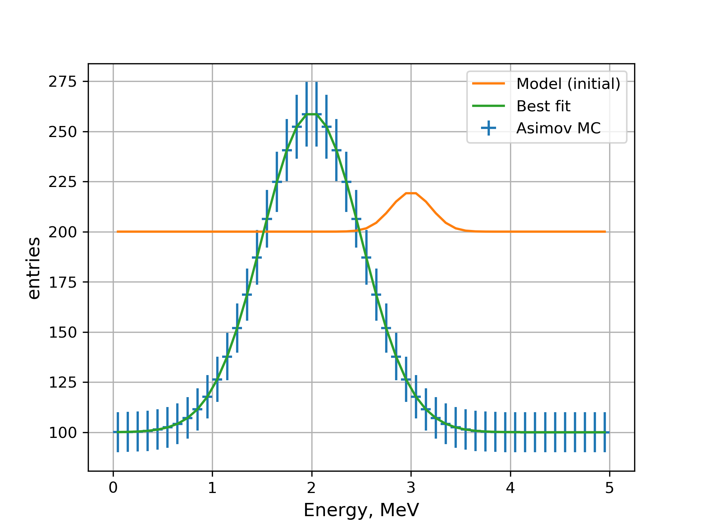
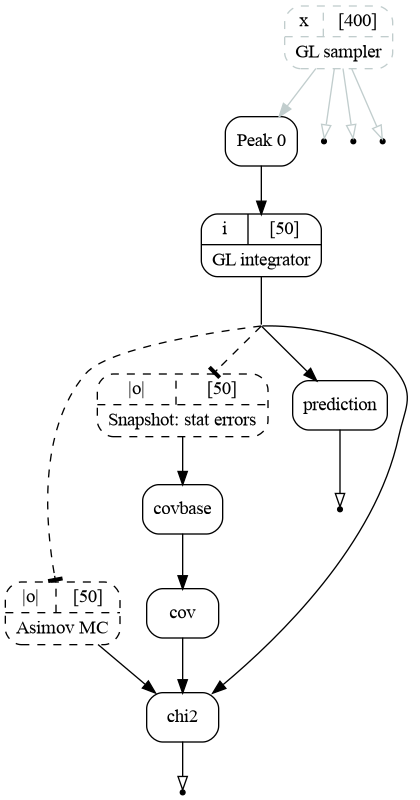

Using snapshot UI to to make MC
"""""""""""""""""""""""""""""""

When the model contains a lot of elements and parameters it becomes inconvenient to create multiple copies of the model.
A `snapshot` UI may be used to save the state of any output. It uses `Snapshot` transformation. An example from the
:ref:`fitting_asimov` may be simplified as follows:

.. literalinclude:: ../../../macro/tutorial/fit/02_fit_script_snapshot.sh
    :lines: 3-
    :linenos:
    :emphasize-lines: 8
    :caption: :download:`02_fit_script_snapshot.sh <../../../macro/tutorial/fit/02_fit_script_snapshot.sh>`

The second model is replaced by the frozen copy of the original model. Snapshot UI takes at least two arguments:
the output to read and the output to create. In current case the model from `peak/spectrum` is copied to the
`peak/spectrum_MC` and frozen. The outputs remain bound though, so `peak/spectrum_MC` may be updated based on the new
state of the `peak/spectrum` manually.

The fit produces identical result as the previous:

   MC data defined by the model `peak/spectrum_MC`, initial and best fit state of the model `peak/spectrum`.

.. literalinclude:: ../../img/tutorial/fit/02_fit_models_snapshot.out
    :linenos:
    :lines: 16-43
    :emphasize-lines: 3,12,19

The full graph of this setup is presented below. The nodes for Asimov MC and statistical errors are shown with dashed
borders which indicates that their data is frozen after being read and will not be updated when minimizer will change
the model parameters.

    The computational graph used to fit the current model.
