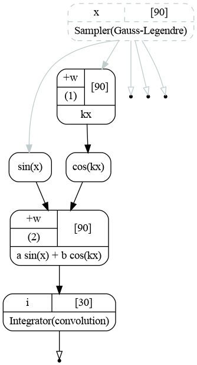
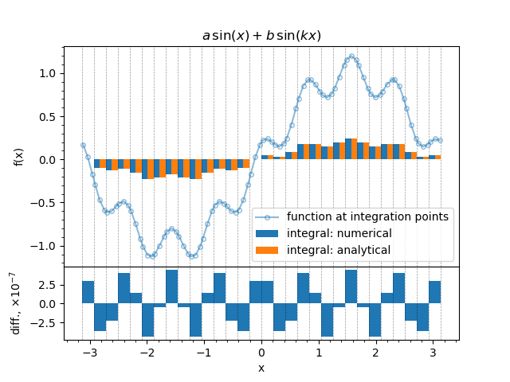

.. _tutorial_integration:

1d integration
''''''''''''''

Let us now integrate the following function:

.. math::
   :label: integral_1d_function

   f(x) = a\sin(x) + b\cos(kx)

in 30 intervals in a range :math:`(-\pi,\pi)`. The analytic integral we will use as a cross check reads as follows:

.. math::
   :label: integral_1d_int

   \int f(x)\,dx = -a\cos(x) + \frac{b}{k}\sin(kx) + C.

The example script is below. We will use the Gauss-Legendre quadrature rule with 3 points for each bin.

.. literalinclude:: ../../../macro/tutorial/complex/01_integral1d.py
    :linenos:
    :lines: 4-104,110
    :emphasize-lines: 28-29,32-33,37
    :caption: :download:`01_integral1d.py <../../../macro/tutorial/complex/01_integral1d.py>`

Before going into details let us first look at the graph that follows the procedure described in
:ref:`tutorial_integration_intro`.

    Computatinal graph used to integrate function :math:`f(x)=a\sin(x)+b\cos(kx)`.

The sampler provide an array of :math:`x`, all the points needed to compute the integral. The points are used as input
to the chain of 4 transformations implementing the integrand function :eq:`integral_1d_function`. The output of the
function is then passed to the integrator, that does the convolution and produces the histogram. The unbound sampler
output contains the bins' edges.

We now skip the definition of the parameters as it was done in previous examples and go to the initialization of the
integrator.

.. literalinclude:: ../../../macro/tutorial/complex/01_integral1d.py
    :lines: 26-28,31-32

Here we define the 31 edges in a range :math:`(-\pi,\pi)` for 30 bins and choose the integration orders (3). The orders
may be specified for each bin in separate, in this case the `orders` variable should contain a numpy array of size 30
with integers. Since we are using raw [#]_ constructor we explicitly have specified the data type 'd' for bin edges.

In the last line we get the output with integration points.

The function :eq:`integral_1d_function` is defined as follows:

.. literalinclude:: ../../../macro/tutorial/complex/01_integral1d.py
    :lines: 35-38

We create multiplication by :math:`k` as ``WeightedSum`` with one item: integration points (:math:`x`) weighted by
:math:`k`. Then we create :math:`\sin` and :math:`\cos` and sum them in another instance of ``WeightedSum``. The last
step is to pass the output of the function to the integrator:

.. literalinclude:: ../../../macro/tutorial/complex/01_integral1d.py
    :lines: 40

That is it. The integration chain is ready. This chain will react to the change of the variables. Moreover, if, for
example, only the value of :math:`a` is changed, the branch with :math:`cos(kx)` will not be executed since it has the
cached result for all the values of :math:`x`. In this case only :math:`sin(x)`, the following ``WeightedSum`` and the
integrator will be triggered.

The status of the integrator object with two transformations is the following:

.. code-block:: text

   [obj] IntegratorGL: 2 transformation(s), 0 variables
    0 [trans] points: 0 input(s), 2 output(s)
        0 [out] x: array 1d, shape 90, size  90
        1 [out] xedges: array 1d, shape 31, size  31
    1 [trans] hist: 1 input(s), 1 output(s)
        0 [in]  f <- [out] sum: array 1d, shape 90, size  90
        0 [out] hist: hist,  30 bins, edges -3.14159265359->3.14159265359, width 0.209439510239

31 bin edges, 30 bins, 3 points per bin: 90 integration points in total.

In order to cross check the integrator let us also implement the analytical solution for antiderivative :math:`F` from
:eq:`integral_1d_int`.

.. literalinclude:: ../../../macro/tutorial/complex/01_integral1d.py
    :lines: 62-64

Here we obtain the values of the parameters, compute the antiderivative for each bin edge and then compute the
integrals as differences. The result our the computations is shown on the figure below.

    The Gauss-Legendre quadrature application to the function :eq:`integral_1d_function`.

The line-marker plot represents the value of the function computed at the integration points. Dashed lines show the bin
edges. One may see that since Gauss-Legendre quadrature is used the integration points are located unevenly within
bins. Two integrals are plotted as bar charts stacked left-to-right: the output of the integrator and the analytical
solution. The lower plot shows the difference between the integrator output and the solution.

Different integrators
+++++++++++++++++++++

For 1d case there are 3 integrators implemented: Gauss-Legendre, rectangular and trapezoidal. They may be used in a
similar fashion:

.. code-block:: python

   integrator = R.IntegratorGL(nbins, orders, x_edges)
   integrator = R.IntegratorRect(nbins, orders, x_edges)
   integrator = R.IntegratorTrap(nbins, orders, x_edges)

all the other procedures are similar. The rectangular integration has an extra option that specifies the rectangles'
alignment within the interval. The default is `center`.

.. code-block:: python

   integrator = R.IntegratorRect(nbins, orders, x_edges, 'left')
   integrator = R.IntegratorRect(nbins, orders, x_edges, 'center')
   integrator = R.IntegratorRect(nbins, orders, x_edges, 'right')

A final note on the integration order. For each integrator order means the number of points needed to integrate a single
bin. Therefore for :math:`N` bins each integrated with order of :math:`O_i` the total number of integration points will
be:

.. math::

   N_p = \sum\limits_i^N O_i.

In case of the trapezoidal rule :math:`N-1` points are on the adjacent bin edges. Thus the total number of points is:

.. math::
   N_p = \sum\limits_i^N O_i - (N-1).

.. [#] The constructors defined in C++ require the C++ datatypes to be passed. Numpy arrays should have the appropriate
       datatype specified, `'d'` for doubles and `'i'` for integers. On the other hand, the constructors defined in the
       `gna.constructors` library do implicit conversion.
