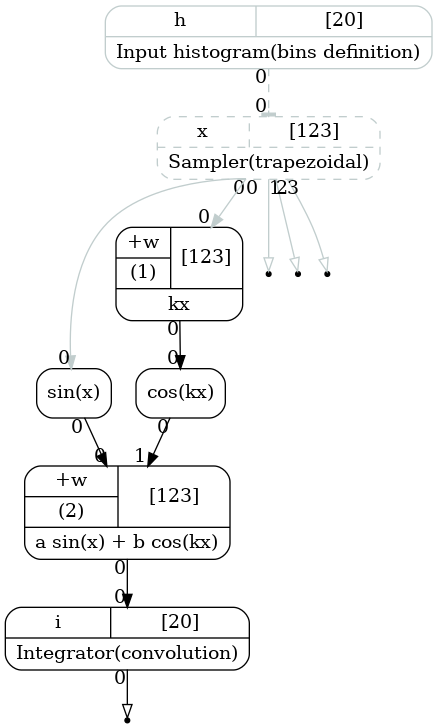

.. _tutorial_integration_again:

More on 1d integration
''''''''''''''''''''''

Now let us repeat the previous study with several changes:

#. Try binning with variable widths as well as variable integration orders.
#. Check that changing variables affects the integration.
#. Use an alternative way of bin edges specification.
#. Use an alternative way of binding the function output.
#. Use an alternative integration method.

Here is the code:

.. literalinclude:: ../../../macro/tutorial/complex/02_integral1d_again.py
    :linenos:
    :lines: 4-124, 128
    :emphasize-lines: 30,33,34,43,103-115
    :caption: :download:`02_integral1d_again.py <../../../macro/tutorial/complex/02_integral1d_again.py>`

First of all, instead of passing the bin edges as an argument we make a histogram first.

.. literalinclude:: ../../../macro/tutorial/complex/02_integral1d_again.py
    :lines: 33

Usually we would like to have only one bins definition for the computational chain, thus, if several integrations occur,
it is more convenient to provide bin edges via input.

.. literalinclude:: ../../../macro/tutorial/complex/02_integral1d_again.py
    :lines: 36-37

Note that the integrator is created without bins passed as an argument. Only in this case the `points.edges` input is
created. The variable `orders` now contains a numpy array with integers. Instead of Gauss-Legendre in this example we
will use the trapezoidal integration.

Then we use the similar function as we have used in the previous example. Instead of binding it directly we use a method
``add_input(output)``. This method may be used several times. On each execution it will create and bind a new input. A
new output is created for each input. Thus for the same bins and orders the transformation may calculate several
integrals within one execution.

.. literalinclude:: ../../../macro/tutorial/complex/02_integral1d_again.py
    :lines: 46

The method returns the corresponding output.

Note, that because of the taintflag propagation, even in case only one input is tainted, all the integrals will be
recalculated. Multiple transformations should be used in case such a behaviour is not desired.

The code produces the following computational chain:

    Computatinal graph used to integrate function :math:`f(x)=a\sin(x)+b\cos(kx)`. The bin edges are passed via input.

Then we repeat the same procedure with cross checking the calculation. The plot below illustrates the variable bin
widths as well as variable integration orders.

    The trapezoidal quadrature application to the function :eq:`integral_1d_function`. Variable bin width and
    different integration orders per bin.

In order to illustrate the impact of the parameters on the results let us create a function, that plots function
:eq:`integral_1d_function`, its integrals for the current values of the parameters:

.. literalinclude:: ../../../macro/tutorial/complex/02_integral1d_again.py
    :lines: 106-110

Now we make three plots for different values of the parameters:

.. literalinclude:: ../../../macro/tutorial/complex/02_integral1d_again.py
    :lines: 112-118

The result is shown on the figure below:

    The trapezoidal quadrature application to the function :eq:`integral_1d_function` for different values of the
    parameters :math:`a`, :math:`b` and :math:`k`.
