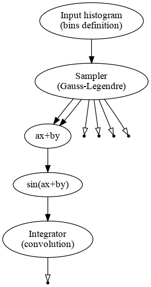
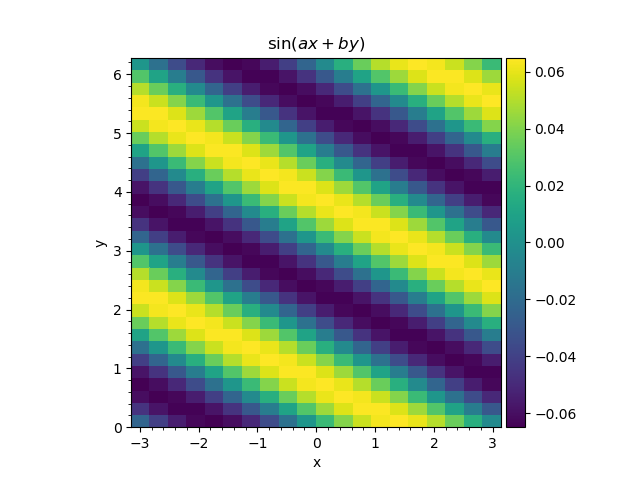
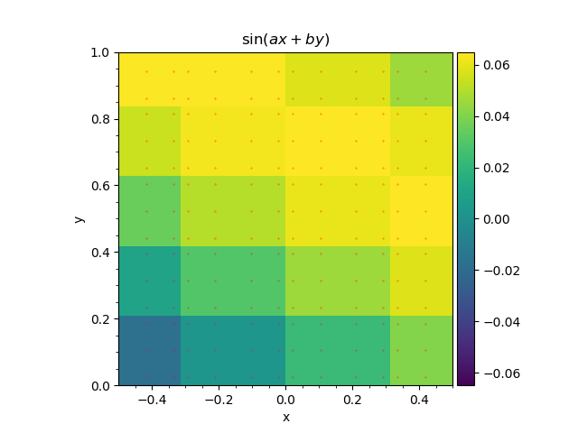
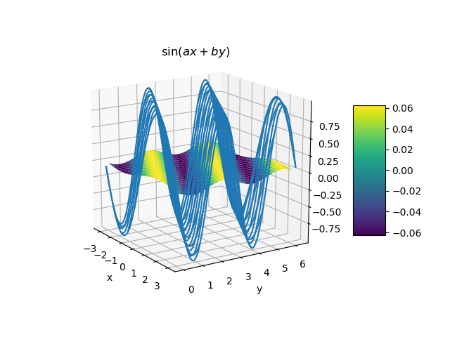

2d integration
''''''''''''''

Introduction
++++++++++++

The formula for numerical 2d integration from :ref:`tutorial_integration_intro`

.. math::
   :label: quad2_again

   H_{km}
   &=
   \int\limits_{a_k}^{a_{k+1}}
   dx
   \int\limits_{b_m}^{b_{m+1}} f(x, y)\,dy
   \approx
    \sum\limits_{i_k=1}^{K_k}
    \sum\limits_{j_m=1}^{M_m}
    \omega_{i_k}^x
    \omega_{j_m}^y
    f(x_{i_k}, y_{j_m}),
    \\
    x_{i_k} &\in [a_i, a_{i+1}],
    \\
    y_{j_m} &\in [b_j, b_{j+1}].

implies that the function :math:`f(x,y)` is computed on each pair of values of :math:`x` and :math:`y`. Let's write all
the required values of :math:`x` and :math:`y` for all the bins as 1d arrays:

.. math::

   x = {x_1, x_2, \dotsc, x_N},\\
   y = {y_1, y_2, \dotsc, x_M}.

In order to have all the possible pairs we need to define two matrices (meshes) of size :math:`N\times M`. Values of
:math:`x` go over first dimension (rows) while values of :math:`y` go to the second dimension (columns).

.. math::
   :label: quad2_mesh

   &X_\text{mesh} = \begin{pmatrix}
   x_1 & x_1 & \dots & x_1 \\
   x_2 & x_2 & \dots & x_2 \\
   \vdots & \vdots & \ddots & \vdots \\
   x_N & x_N & \dots & x_N \\
   \end{pmatrix}
   \\
   \\
   &Y_\text{mesh} = \begin{pmatrix}
   y_1 & y_2 & \dots & y_M \\
   y_1 & y_2 & \dots & y_M \\
   \vdots & \vdots & \ddots & \vdots \\
   y_1 & y_2 & \dots & y_M \\
   \end{pmatrix}

The value of the function is then computed as :math:`f(X_\text{mesh}, Y_\text{mesh})`, on each pair of values.

2d integral example
+++++++++++++++++++

Let us now integrate the following function:

.. math::
   :label: integral_2d_function

   f(x,y) = \sin(ax+by).

into 2d histograms with 20 bins over X axis :math:`(-\pi,\pi)` and 30 bins over Y axis :math:`(0,2\pi)`. We choose
constant integration orders: 4 points per bin for X and 3 points per bin for Y.

Just in case, its integral reads as follows:

.. math::
   &\int\limits_{x_1}^{x_2}dx
   \int\limits_{y_1}^{y_2}dy
   f(x,y)
   = \\ 
   &=
   -\frac{1}{ab} \left(
    \sin( ax_2 + by_2 )
    +
    \sin( ax_1 + by_1 )
    -
    \sin( ax_2 + by_1 )
    -
    \sin( ax_1 + by_2 )
   \right).

The procedure of performing the numerical integration is actually very similar to 1d case.

.. literalinclude:: ../../../macro/tutorial/complex/03_integral2d.py
    :linenos:
    :lines: 4-
    :emphasize-lines: 34,37,42,46
    :caption: :download:`03_integral2d.py <../../../macro/tutorial/complex/03_integral2d.py>`

The code produces the following graph. The sampler now produces two arrays for :math:`x` and :math:`y`:, which are then
passed to the computational chain representing the integrand function and the output of the chain is passed back to the
integrator, which computes the histogram.

    Computatinal graph used to compute double integral of a function :math:`f(x,y)=\sin(ax+by)`.

At first we create a 2d histogram to be used to define the bins:

.. literalinclude:: ../../../macro/tutorial/complex/03_integral2d.py
    :lines: 37

Then initialize 2d Gauss-Legendre integrator by providing number of bins and integration order(s) for each dimension and
bind the histogram defining the bin edges.

.. literalinclude:: ../../../macro/tutorial/complex/03_integral2d.py
    :lines: 40-41

An alternative way with bin edges passed as arguments reads as follows

.. code-block:: python

    integrator = R.Integrator2GL(x_nbins, x_orders, x_edges, y_nbins, y_orders, y_edges).

The status of the integrator object may be found below:

.. code-block:: text

   [obj] Integrator2GL: 2 transformation(s), 0 variables
        0 [trans] points: 1 input(s), 6 output(s)
            0 [in]  edges <- [out] hist: hist2d, 20x30=600 bins, edges -3.14159265359->3.14159265359 and 0.0->6.28318530718
            0 [out] x: array 1d, shape 80, size  80
            1 [out] y: array 1d, shape 90, size  90
            2 [out] xedges: array 1d, shape 21, size  21
            3 [out] yedges: array 1d, shape 31, size  31
            4 [out] xmesh: array 2d, shape 80x90, size 7200
            5 [out] ymesh: array 2d, shape 80x90, size 7200
        1 [trans] hist: 1 input(s), 1 output(s)
            0 [in]  f <- [out] result: array 2d, shape 80x90, size 7200
            0 [out] hist: hist2d, 20x30=600 bins, edges -3.14159265359->3.14159265359 and 0.0->6.28318530718

The transformation `points` contains 1d arrays with edges for X and Y axes (`xedges` and `yedges`), 1d arrays with
integration points for X and Y axes (`x` and `y`). Finally it contains the 2d meshes (`xmesh` and `ymesh`) as defined in
:eq:`quad2_mesh`.

These meshes are then passed to the ``WeightedSum`` to be added with weights :math:`a` and :math:`b` and result of a sum
is passed to the sine object.

.. literalinclude:: ../../../macro/tutorial/complex/03_integral2d.py
    :lines: 45-46

These two lines implement the function :ref:`integral_2d_function`. The output of this function is passed to the
integrator:

.. literalinclude:: ../../../macro/tutorial/complex/03_integral2d.py
    :lines: 49

That is it. Then the output `integrator.hist.hist` contains the 2d histogram with integrated function, which may be
plotted:

    Double Gauss-Legendre quadrature application to the function :eq:`integral_2d_function`.

We then zoom the plot to display the integration points.

    Double Gauss-Legendre quadrature application to the function :eq:`integral_2d_function`. Red dots represent the
    integration points.

    Double Gauss-Legendre quadrature application to the function :eq:`integral_2d_function` compared to the function
    itself.
