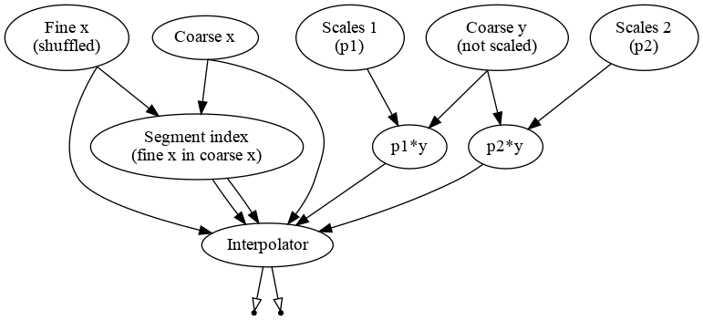
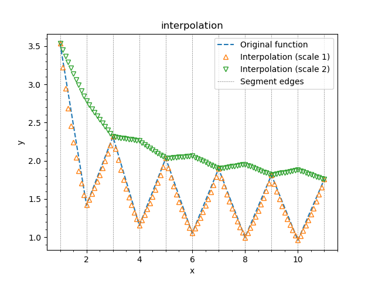

.. _tutorial_interpolation:

1d interpolation
''''''''''''''''

In this example we will review another object defined by two transformations. :Ref:`InterpExpo <InterpExpo>` implements
exponential interpolation. For a function defined as set of points :math:`y_j(x_j)`, the interpolation function reads as
follows:

.. math::

   f(z) = y_j e^{-(z - x_j) b_j} \quad \text{for} \quad z \in (x_j, x_{j+1}).

The coefficients :math:`b_j` are chosen so that the function was continuous. The example goes as follows.

.. literalinclude:: ../../../macro/tutorial/complex/05_interpolation.py
    :linenos:
    :lines: 4-
    :caption: :download:`05_interpolation.py <../../../macro/tutorial/complex/05_interpolation.py>`

We start from defining the bin edges. 10 segments, 11 bin edges from 1 to 11.

.. literalinclude:: ../../../macro/tutorial/complex/05_interpolation.py
    :linenos:
    :lines: 12-17

When creating the ``Points`` instance we pass the `labels` argument. If `labels` is a string it is used to label the
first transformation. In case `labels` is a list or tuple, it is used to label first transformations one by one.

Then we create a set of :math:`x` points which will be used for interpolation. The input may be of any shape (vector or
matrix). The points may be not ordered. In the following example we shuffle them.

.. literalinclude:: ../../../macro/tutorial/complex/05_interpolation.py
    :linenos:
    :lines: 19-22

For the sake of illustration we define saw-like function :math:`y_0=f(x_j)`:

.. literalinclude:: ../../../macro/tutorial/complex/05_interpolation.py
    :linenos:
    :lines: 24-29

Let us then define two target functions :math:`y_1 = p_1 y_0` and :math:`y_2 = p_2 y_0`, where :math:`p_1` and
:math:`p_2` are arrays of the same shape as :math:`y_0`.

We define :math:`p_1` and :math:`p_2` as two sets of parameters each equal to 1 by default:

.. literalinclude:: ../../../macro/tutorial/complex/05_interpolation.py
    :linenos:
    :lines: 31-36

We then use ``VarArray`` transformation, that collects the variables by name and stores them into the array.

.. literalinclude:: ../../../macro/tutorial/complex/05_interpolation.py
    :linenos:
    :lines: 39-43

The arrays are then multiplied in an element-wise manner by :math:`y_0`:

.. literalinclude:: ../../../macro/tutorial/complex/05_interpolation.py
    :linenos:
    :lines: 46-47

Now we have all the ingredients to initialize the interpolator. In the example there presented two was: automatic and
manual. The automatic way is similar to a way integrators are initialized, most of the bindings are done internally:

.. literalinclude:: ../../../macro/tutorial/complex/05_interpolation.py
    :linenos:
    :lines: 66-68

Here were have initialized the interpolator with coarse :math:`x` edges and fine :math:`z` values. The object contains
two transformations. Transformation `insegment` determines which segment each of values of :math:`z` belongs to. It also
calculates the segment widths for later use.

The second transformation `interp` coarse :math:`x`, segment indices and widths to do the interpolation. It may
interpolate several input functions in one call. Here inputs `y` and `y_02` are interpolated to the outputs
`interp` and `interp_02`.

.. code-block:: text

    [obj] InterpExpo: 2 transformation(s), 0 variables
         0 [trans] insegment: 2 input(s), 2 output(s)
             0 [in]  points <- [out] points: array 1d, shape 101, size 101
             1 [in]  edges <- [out] points: array 1d, shape 11, size  11
             0 [out] insegment: array 1d, shape 101, size 101
             1 [out] widths: array 1d, shape 10, size  10
         1 [trans] interp: 6 input(s), 2 output(s)
             0 [in]  newx <- [out] points: array 1d, shape 101, size 101
             1 [in]  x <- [out] points: array 1d, shape 11, size  11
             2 [in]  insegment <- [out] insegment: array 1d, shape 101, size 101
             3 [in]  widths <- [out] widths: array 1d, shape 10, size  10
             4 [in]  y <- [out] product: array 1d, shape 11, size  11
             5 [in]  y_02 <- [out] product: array 1d, shape 11, size  11
             0 [out] interp: array 1d, shape 101, size 101
             1 [out] interp_02: array 1d, shape 101, size 101

The overall code produces the following graph:

   Calculation graph representing the interpolation process for two input functions.

Instead of using the automatic binding, one may bind the transformations manually as follows:

.. literalinclude:: ../../../macro/tutorial/complex/05_interpolation.py
    :linenos:
    :lines: 53-63

Here we are using the syntax, explained :ref:`earlier <tutorial_binding_syntax>`. We pass coarse :math:`x` edges to the
inputs of `insegment` and `interp`, then we do the same for fine :math:`z` values (`points`). Then we pass outputs
`insegment` and `widths` from the `insegment` to the `interp`. `y1` is then binded to the first input while `y2` is
binded to the second input, created by `add_input()` method.

Two input functions may be interpolated by two distinct transformations within the same object.
See the tutorial :ref:`tutorial_topology` for the more details on usage of `add_input()` and `add_transformation()` methods.

Now we leave all :math:`p_1` values equal to 1 so the first graph represent the initial coarse function. For the second
curve we set each odd parameter to 2 to compensate the saw-like structure.

.. literalinclude:: ../../../macro/tutorial/complex/05_interpolation.py
    :linenos:
    :lines: 74-75

After plotting `y1` and `y2` let us set each even :math:`p_1` to 0.5 and plot again. The result may be found on the
picture below.

    Example of exponential interpolation.

The dashed lines black represent the segment edges, the dashed blue line is the initial coarse function defined on these
edges. Orange squares represent the interpolated function. They are slightly off the straight line since we have used
exponential interpolation. Green triangles are for `y2` and the red triangles are for `y1` again after we scaled each
even parameter down.

