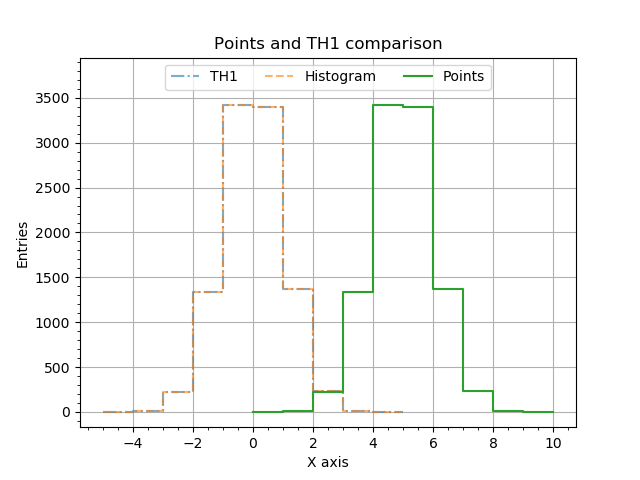
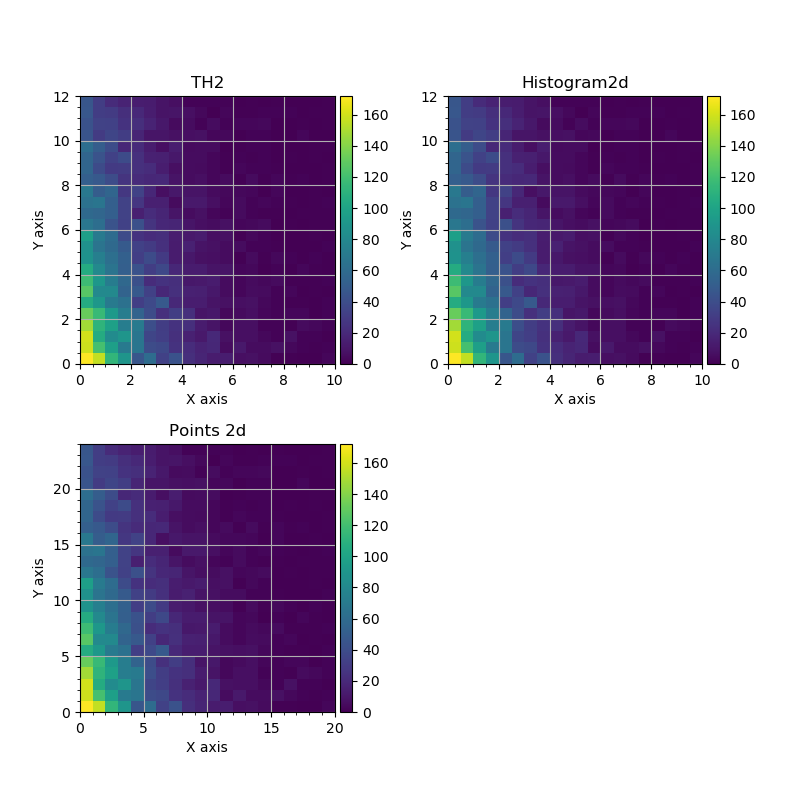

.. _tutorial_misc_importing_root:

Importing data from ROOT files
""""""""""""""""""""""""""""""

Importing data from ROOT files is easy: `Points` and `Histogram`/`Histogram2d` objects may be constructed directly from
`TMatrixD`/`TMatrixF`/`TH1`/`TH2` objects. An example may be found in the following file
:download:`misc_importing_from_root.py <../../../macro/tutorial/misc/misc_importing_from_root.py>`.

Here we will discuss only main functions and points. Firstly let us create `TH1D`, `TH2D` and `TMatrixD`.

.. literalinclude:: ../../../macro/tutorial/misc/misc_importing_from_root.py
    :lines: 17-19

Then, after ROOT objects are filled, or just read from the ROOT file, the GNA objects may be created with their regular
constructors:

.. literalinclude:: ../../../macro/tutorial/misc/misc_importing_from_root.py
    :lines: 37-39,42-43

The single precision versions `TH1F`, `TH2F` and `TMatrixF` are valid as well.

It should be noted, that
    - `Points` loose any information on bin edges.
    - Internally `TH2` keeps the data in transposed order, i.e. first index represents y-coordinate, while second index
      represents x-coordinate. When converted to `Histogram2d` the memory order is changed implicitly to x/y for
      first/second index.

The difference between array-like and histogram-like representation may be seen from the following figures.

   1d histograms plotted from ROOT.TH1D, GNA.Histogram and GNA.Points.

When `Points` object is plotted as histogram, it is assumed that first bin starts at 0 and bin width is 1.

   2d histograms plotted from ROOT.TH2D, GNA.Histogram2d and GNA.Points.

The same applies to `Points` object is plotted as 2d histogram.
