Plotting
^^^^^^^^

Plotting outputs in 2d: plots and histograms
""""""""""""""""""""""""""""""""""""""""""""

GNA defines a set of convenience methods to plot the transformation outputs with matplotlib. The methods are wrappers
for regular `matplotlib <https://matplotlib.org/api/pyplot_api.html>`_ commands. For the complete matplotlib
documentation please refer the official `site <https://matplotlib.org/api/pyplot_api.html>`_.

Plotting arrays
'''''''''''''''

A ``plot(...)`` method is defined implementing
`plot(y, ...) <https://matplotlib.org/api/pyplot_api.html#matplotlib.pyplot.plot>`_ call passing output contents as `y`.
The method works the same way for both arrays and histograms.

.. literalinclude:: ../../../macro/tutorial/plotting/01_points_plot.py
    :linenos:
    :lines: 4-32,39
    :emphasize-lines: 26,27
    :caption: :download:`01_points_plot.py <../../../macro/tutorial/plotting/01_points_plot.py>`

When 1d array is passed (line 25) it is plotted as is while for 2d array (line 6) each column is plotted in separate.
The latter produces the blue line on the following figure while the former produces orange, green and red lines.

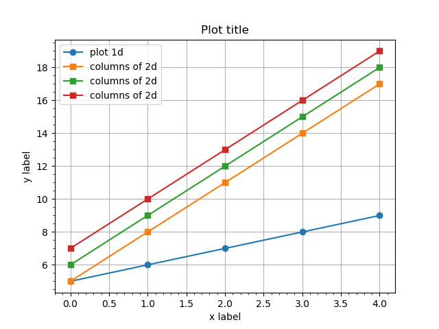

    An example ``output.plot()`` method for outputs with 1d and 2d arrays.

.. table:: Keyword options

    +------------------+---------------------------------+
    | `transpose=True` | transpose array before plotting |
    +------------------+---------------------------------+

Plotting arrays vs other arrays
'''''''''''''''''''''''''''''''

If `X` vs `Y` is desired ``output_y.plot_vs(output_x, ...)`` syntax may be used. Matplotlib
`plot(x, y, ...) <https://matplotlib.org/api/pyplot_api.html#matplotlib.pyplot.plot>`_ function is used.

The twin method ``output_x.vs_plot(output_y, ...)`` may be used in case reversed order is desired.

.. literalinclude:: ../../../macro/tutorial/plotting/02_points_plot_vs.py
    :linenos:
    :lines: 4-28,33
    :emphasize-lines: 23
    :caption: :download:`02_points_plot_vs.py <../../../macro/tutorial/plotting/02_points_plot_vs.py>`

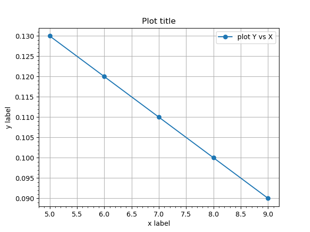

    An example ``output_x.plot_vs(output_y)`` method for outputs.

.. table:: Keyword options

    +------------------+----------------------------------+
    | `transpose=True` | transpose arrays before plotting |
    +------------------+----------------------------------+

.. note::

    The argument of ``plot_vs()`` and ``vs_plot()`` methods may be numpy array as well.

Plotting histograms
'''''''''''''''''''

There are two options to plot 1d histograms provided. First one ``plot_hist()`` is producing regular line plot via 
`pyplot.plot() <https://matplotlib.org/api/pyplot_api.html#matplotlib.pyplot.plot>`_, the second one ``plot_bar()`` is
passing data to `pyplot.bar() <https://matplotlib.org/api/pyplot_api.html#matplotlib.pyplot.bar>`_. See the example
below.

The ``plot_hist()`` has an extra option ``zero_level``, which is by default 0. The options set the ground level for the
histogram that affects how the edges of first and last bins are plotted: they are drawn till the ``zero_level``.

.. literalinclude:: ../../../macro/tutorial/plotting/04_hist_plot.py
    :linenos:
    :lines: 4-44,50
    :emphasize-lines: 26,38
    :caption: :download:`04_hist_plot.py <../../../macro/tutorial/plotting/04_hist_plot.py>`

.. figure:: ../../img/tutorial/04_hist_plot.png
    :align: center

    An example ``output.plot_hist()`` and ``output.plot_bar()`` method for outputs.

.. table:: Keyword options for ``plot_hist()``

    +------------------+---------------------------------------+
    | `zero_level=0.0` | set the ground level of the histogram |
    +------------------+---------------------------------------+

Overlapping histograms
''''''''''''''''''''''

Both plotting methods may be used for plotting multiple histograms. 

Line plots
++++++++++

Multiple `plot_hist()` are plotted as regular plots.

.. literalinclude:: ../../../macro/tutorial/plotting/05_hists_plot.py
   :linenos:
   :lines: 4-23,28-41,76
   :emphasize-lines: 30-32
   :caption: :download:`05_hists_plot.py <../../../macro/tutorial/plotting/05_hists_plot.py>`

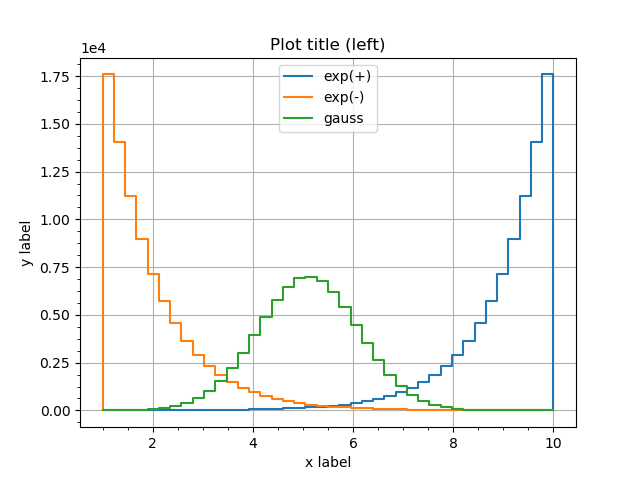

   Several histograms superimposed in ``plot_hist()`` version.

For the bar version there are two ways to plot overlapping histograms. 

Bars' transparency
++++++++++++++++++

First one is to modify the histograms' transparency by setting ``alpha`` option below 1.

.. literalinclude:: ../../../macro/tutorial/plotting/05_hists_plot.py
    :linenos:
    :lines: 44-57,76
    :emphasize-lines: 10-12
    :caption: :download:`05_hists_plot.py <../../../macro/tutorial/plotting/05_hists_plot.py>`

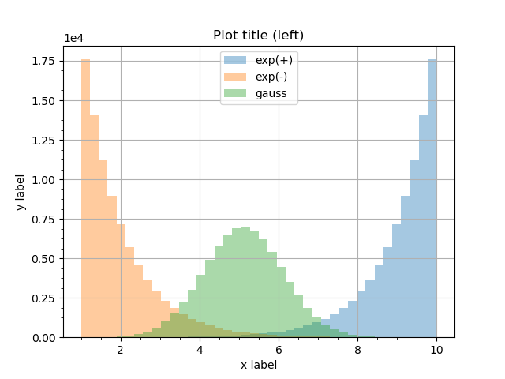

   Several histograms superimposed in ``plot_bar()`` version with transparency.

Bars' width
+++++++++++

The second option is controlled by ``divide`` and ``shift`` options. ``divide`` is an integer factor dividing the bin
width. Setting ``divide=3`` will shrink the bin width three times. The option ``shift`` defines where to plot the shrunk
bin within it's old width: ``shift=0`` shifts it to the left side, ``shift=1`` to the center and ``shift=2`` to the
right side. It is possible to plot overlapping histograms without bins actually overlapping.

.. literalinclude:: ../../../macro/tutorial/plotting/05_hists_plot.py
    :linenos:
    :lines: 60-73,76
    :emphasize-lines: 10-12
    :caption: :download:`05_hists_plot.py <../../../macro/tutorial/plotting/05_hists_plot.py>`

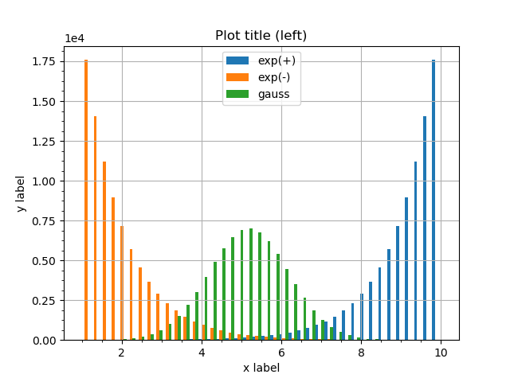

   Several histograms superimposed in ``plot_bar()`` version with shrunk bins.

.. table:: Keyword options for ``plot_bar()``

    +------------+------------------------------------+
    | `divide=N` | Divide each bin width by `N`       |
    +------------+------------------------------------+
    | `shift=M`  | Shift each bin by N widths (`M<N`) |
    +------------+------------------------------------+

Plotting outputs in 2d: 2d histograms
"""""""""""""""""""""""""""""""""""""

.. _matplotlib_matrices:

Matrices
''''''''

The ``plot_matshow(...)`` method is defined implementing
`matshow(A, ...) <https://matplotlib.org/api/pyplot_api.html#matplotlib.pyplot.matshow>`_ call passing output contents as `A`.
This method works with both histograms and arrays. When applied to histograms it ignores bin edges definitions and plots
the matrix anyway: first dimension defines rows, second - columns; the rows are plotted over Y axis and columns of X
axis.

.. literalinclude:: ../../../macro/tutorial/plotting/03_matshow.py
    :linenos:
    :lines: 4-26,32
    :emphasize-lines: 22
    :caption: :download:`03_matshow.py <../../../macro/tutorial/plotting/03_matshow.py>`

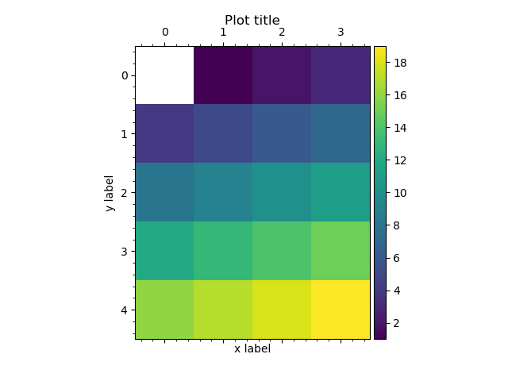

    An example ``output2d.plot_matshow()`` method for outputs.

.. _matplotlib_matrices_options:

.. table:: Keyword options

    +----------------------+------------------------------------------------------------------------------------------------------------------------------+
    | `colorbar=True`      | add a colorbar                                                                                                               |
    +----------------------+------------------------------------------------------------------------------------------------------------------------------+
    | `colorbar=dict(...)` | add a colorbar and pass the options to `colorbar() <https://matplotlib.org/api/pyplot_api.html#matplotlib.pyplot.colorbar>`_ |
    +----------------------+------------------------------------------------------------------------------------------------------------------------------+
    | `mask`               | do not colorize values, equal to `mask`. `mask=0.0` will produce ROOT-like colormaps                                         |
    +----------------------+------------------------------------------------------------------------------------------------------------------------------+
    | `transpose=True`     | transpose arrays before plotting                                                                                             |
    +----------------------+------------------------------------------------------------------------------------------------------------------------------+

.. note::

    Unlike in matplotlib ``output.matshow()`` will not create extra figure by default. See `fignum` option description
    in `matshow() <https://matplotlib.org/api/pyplot_api.html#matplotlib.pyplot.matshow>`_ documentation.

2d histograms with constant binning
'''''''''''''''''''''''''''''''''''

There are several options to plot 2d histograms as histograms, i.e. with first dimension over X and second dimension
over Y. In case the histogram has bins of equal width ``plot_pcolorfast()`` or ``plot_imshow()`` may be used. Both
methods support the same extra options as :ref:`matshow <matplotlib_matrices_options>`.

pcolorfast
++++++++++

``plot_pcolorfast(...)`` method implements a
`pcolorfast(X, Y, C, ...) <https://matplotlib.org/api/_as_gen/matplotlib.axes.Axes.pcolorfast.html?highlight=pcolorfast#matplotlib.axes.Axes.pcolorfast>`_ 
call passing output contents as `X`, `Y` and `C`. Below see an example of Gaussian with width 10 for X and width 3 for
Y.

.. literalinclude:: ../../../macro/tutorial/plotting/06_hist2d_plot_equal.py
    :linenos:
    :lines: 4-24,29-37,62
    :emphasize-lines: 29
    :caption: :download:`06_hist2d_plot_equal.py <../../../macro/tutorial/plotting/06_hist2d_plot_equal.py>`

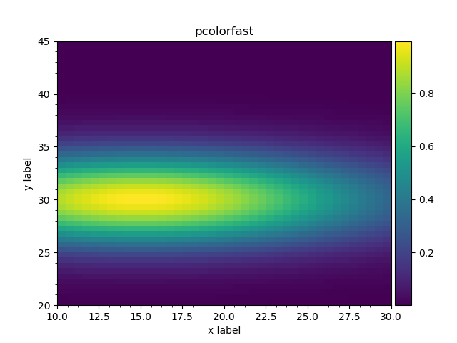

    2d histogram plotted via ``plot_pcolorfast()`` method.

imshow
++++++

The second method ``plot_imshow()`` is using
`imshow(X, ...) <https://matplotlib.org/api/pyplot_api.html#matplotlib.pyplot.imshow>`_ passing output data as `X`. The
``imshow()`` method is designed to show images and thus it sets the equal visual size for `x` and `y` intervals [#]_.

.. literalinclude:: ../../../macro/tutorial/plotting/06_hist2d_plot_equal.py
    :linenos:
    :lines: 47
    :caption: :download:`06_hist2d_plot_equal.py <../../../macro/tutorial/plotting/06_hist2d_plot_equal.py>`

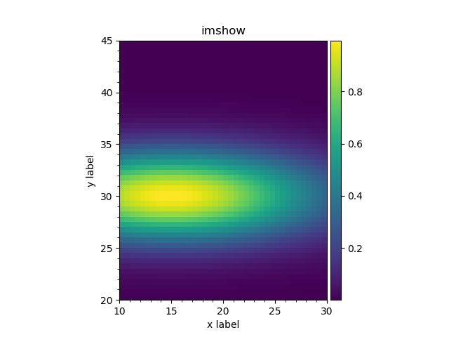

   2d histogram plotted via ``plot_imshow()`` method.

.. [#] Similar effect may be achieved to any plot with ``ax.set_aspect('equal')``.

matshow
+++++++

The relevant plot, produced by the ``plot_matshow()`` may be found below.

.. literalinclude:: ../../../macro/tutorial/plotting/06_hist2d_plot_equal.py
    :linenos:
    :lines: 58
    :caption: :download:`06_hist2d_plot_equal.py <../../../macro/tutorial/plotting/06_hist2d_plot_equal.py>`

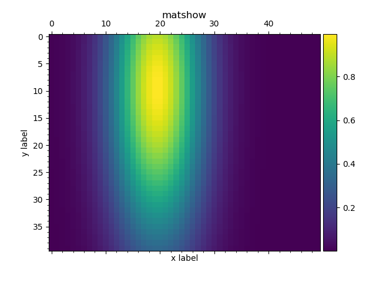

   2d histogram, plotted as matrix.

.. _matplotlib_hist2d_var:

2d histograms with variable binning
'''''''''''''''''''''''''''''''''''

In case histograms have bins of variable size ``plot_pcolormesh()`` method should be used. It is using
`pcolormesh(X, Y, C, ...) <https://matplotlib.org/api/pyplot_api.html#matplotlib.pyplot.pcolormesh>`_ call passing
output data as `X`, `Y` and `C`. The method essentially works for the constant binning histograms as well.
The method supports the same extra options as :ref:`matshow <matplotlib_matrices_options>`.

We will use a Gaussian with width 150 for X and 0.1 for Y.

.. literalinclude:: ../../../macro/tutorial/plotting/06_hist2d_plot.py
   :linenos:
   :lines: 4-24,29-37,51
   :emphasize-lines: 29
   :caption: :download:`06_hist2d_plot.py <../../../macro/tutorial/plotting/06_hist2d_plot.py>`

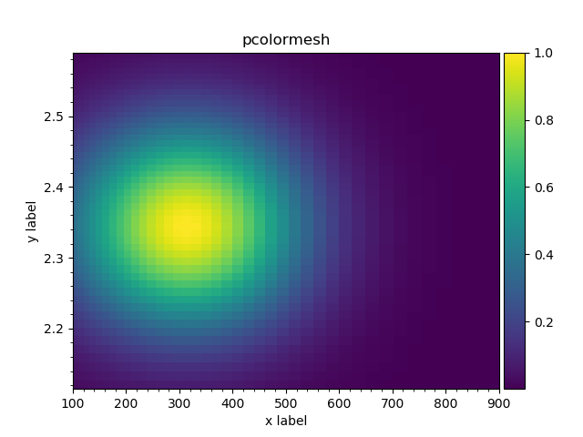

   2d histogram with variable binning.

Plotting outputs in 3d: 2d histograms
"""""""""""""""""""""""""""""""""""""

2d histograms
'''''''''''''

2d histograms as in :ref:`example <matplotlib_hist2d_var>` may be plotted in 3d. Three methods are provided for this
purpose. All the methods support the same extra options as :ref:`matshow <matplotlib_matrices_options>`.

Surface
+++++++

The method ``plot_surface`` is using
`plot_surface(X, Y, Z, ...) <https://matplotlib.org/api/_as_gen/mpl_toolkits.mplot3d.axes3d.Axes3D.html?highlight=plot_surface#mpl_toolkits.mplot3d.axes3d.Axes3D.plot_surface>`_ 
matplotlib function passing output data as `X`, `Y` and `Z`. 

.. literalinclude:: ../../../macro/tutorial/plotting/06_hist2d_plot3d.py
   :linenos:
   :lines: 4-23,29-39,64
   :emphasize-lines: 21,24,30
   :caption: :download:`06_hist2d_plot3d.py <../../../macro/tutorial/plotting/06_hist2d_plot3d.py>`

In order the surface was colorized ``cmap`` option should be passed with a valid colormap name (use `viridis`).

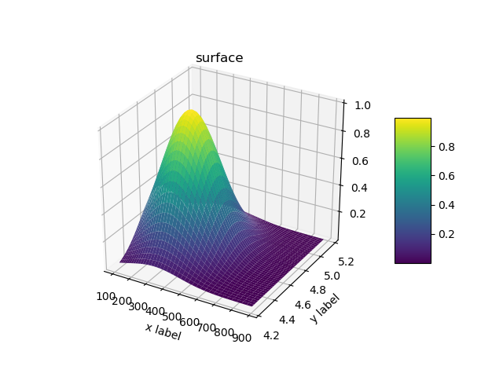

   2d histogram, plotted via ``plot_surface()`` method.

.. note::

    Note that ``mplot3d`` toolkit should be used (line 20) and the ``projection='3d'`` option should be set for a
    subplot (line 23).

3d bars
+++++++

The method ``plot_bar3d`` is using
`bar3d(X, Y, Z, dX, dY, dZ, ...) <https://matplotlib.org/api/_as_gen/mpl_toolkits.mplot3d.axes3d.Axes3D.html?highlight=bar3d#mpl_toolkits.mplot3d.axes3d.Axes3D.bar3d>`_ 
matplotlib function passing output data as `X`, `Y`, `Z`, `dX`, `dY`, `dZ`. 

By default the bars are not colorized: ``cmap=True`` may be used to colorize the bars with default colormap.

.. literalinclude:: ../../../macro/tutorial/plotting/06_hist2d_plot3d.py
   :linenos:
   :lines: 49
   :caption: :download:`06_hist2d_plot3d.py <../../../macro/tutorial/plotting/06_hist2d_plot3d.py>`

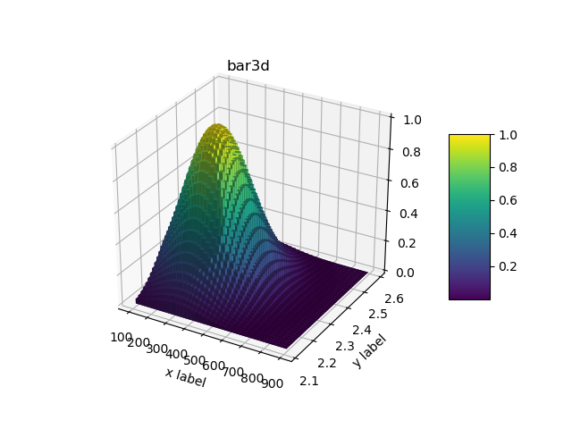

   2d histogram, plotted via ``plot_bar3d()`` method.

Wireframe
+++++++++

The method ``plot_wireframe`` is using
`plot_wireframe(X, Y, Z, ...) <https://matplotlib.org/api/_as_gen/mpl_toolkits.mplot3d.axes3d.Axes3D.html?highlight=plot_wireframe#mpl_toolkits.mplot3d.axes3d.Axes3D.plot_wireframe>`_ 
matplotlib function passing output data as `X`, `Y`, and `Z`.

By default wire frame is not colorized: ``cmap=True`` may be used to colorize the wires with default colormap.

.. literalinclude:: ../../../macro/tutorial/plotting/06_hist2d_plot3d.py
   :linenos:
   :lines: 60
   :caption: :download:`06_hist2d_plot3d.py <../../../macro/tutorial/plotting/06_hist2d_plot3d.py>`

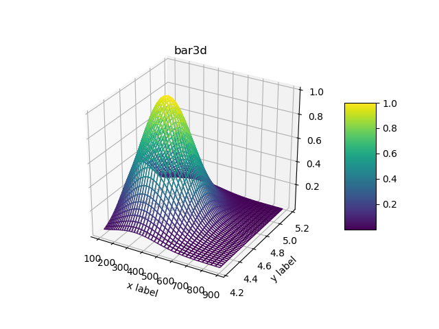

   2d histogram, plotted via ``plot_wireframe()`` method.
