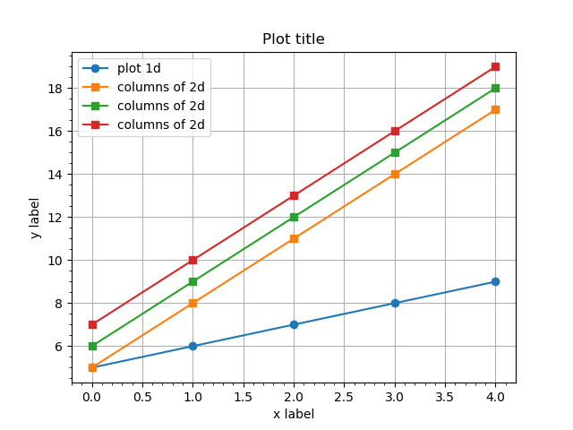
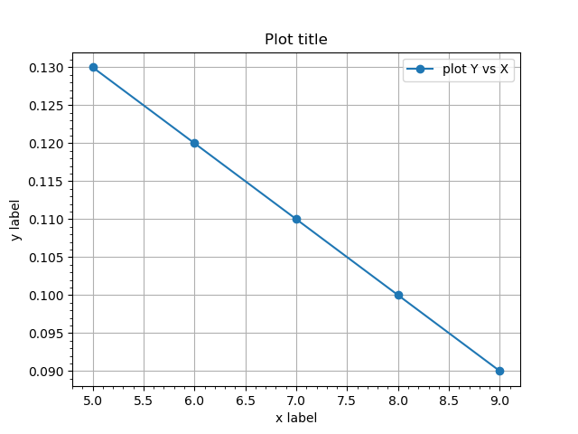
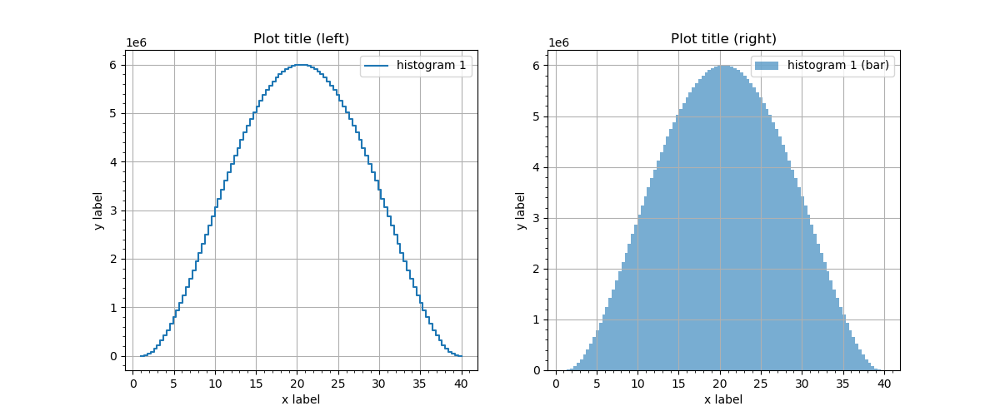
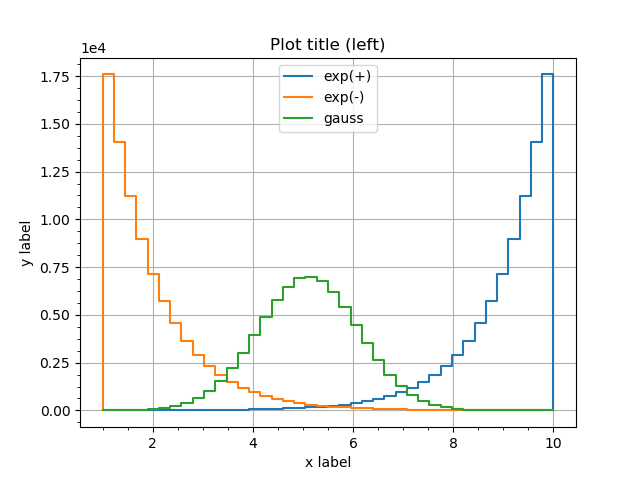
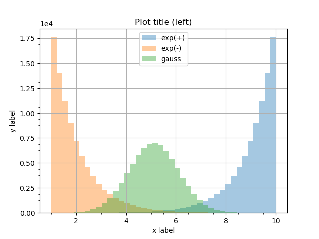
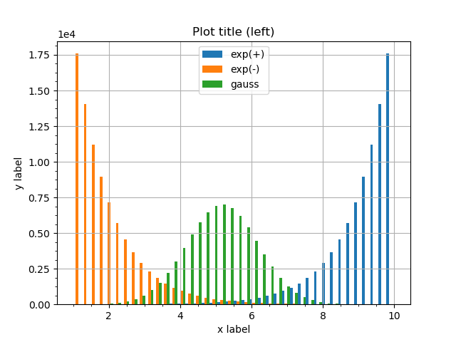

Plotting outputs in 2d: plots and histograms
^^^^^^^^^^^^^^^^^^^^^^^^^^^^^^^^^^^^^^^^^^^^

GNA defines a set of convenience methods to plot the transformation outputs with matplotlib. The methods are wrappers
for regular `matplotlib <https://matplotlib.org/api/pyplot_api.html>`_ commands. For the complete matplotlib
documentation please refer the official `site <https://matplotlib.org/api/pyplot_api.html>`_.

Plotting arrays
"""""""""""""""

A ``plot(...)`` method is defined implementing
`plot(y, ...) <https://matplotlib.org/api/pyplot_api.html#matplotlib.pyplot.plot>`_ call passing output contents as `y`.
The method works the same way for both arrays and histograms.

.. literalinclude:: ../../../macro/tutorial/basic/04_points_plot.py
    :linenos:
    :lines: 4-31,38
    :emphasize-lines: 25,26
    :caption: :download:`04_points_plot.py <../../../macro/tutorial/basic/04_points_plot.py>`

When 1d array is passed (line 25) it is plotted as is while for 2d array (line 6) each column is plotted in separate.
The latter produces the blue line on the following figure while the former produces orange, green and red lines.

    A example ``output.plot()`` method for outputs with 1d and 2d arrays.

.. table:: Keyword options

    +------------------+---------------------------------+
    | `transpose=True` | transpose array before plotting |
    +------------------+---------------------------------+

Plotting arrays vs other arrays
"""""""""""""""""""""""""""""""

If `X` vs `Y` is desired ``output_y.plot_vs(output_x, ...)`` syntax may be used. Matplotlib
`plot(x, y, ...) <https://matplotlib.org/api/pyplot_api.html#matplotlib.pyplot.plot>`_ function is used.

The twin method ``output_x.vs_plot(output_y, ...)`` may be used in case reversed order is desired.

.. literalinclude:: ../../../macro/tutorial/basic/05_points_plot_vs.py
    :linenos:
    :lines: 4-27,34
    :emphasize-lines: 22
    :caption: :download:`05_points_plot_vs.py <../../../macro/tutorial/basic/05_points_plot_vs.py>`

    A example ``output_x.plot_vs(output_y)`` method for outputs.

.. table:: Keyword options

    +------------------+----------------------------------+
    | `transpose=True` | transpose arrays before plotting |
    +------------------+----------------------------------+

Plotting histograms
"""""""""""""""""""

There are two options to plot 1d histograms provided. First one ``plot_hist()`` is producing regular line plot via 
`pyplot.plot() <https://matplotlib.org/api/pyplot_api.html#matplotlib.pyplot.plot>`_, the second one ``plot_bar()`` is
passing data to `pyplot.bar() <https://matplotlib.org/api/pyplot_api.html#matplotlib.pyplot.bar>`_. See the example
below.

The ``plot_hist()`` has an extra option ``zero_level``, which is by default 0. The options set the ground level for the
histogram that affects how the edges of first and last bins are plotted: they are drawn till the ``zero_level``.

.. literalinclude:: ../../../macro/tutorial/basic/07_hist_plot.py
    :linenos:
    :lines: 4-43,49
    :emphasize-lines: 25,37
    :caption: :download:`07_hist_plot.py <../../../macro/tutorial/basic/07_hist_plot.py>`

    A example ``output.plot_hist()`` and ``output.plot_bar()`` method for outputs.

.. table:: Keyword options for ``plot_hist()``

    +------------------+---------------------------------------+
    | `zero_level=0.0` | set the ground level of the histogram |
    +------------------+---------------------------------------+

Overlapping histograms
""""""""""""""""""""""

Both plotting methods may be used for plotting multiple histograms. 

Line plots
''''''''''

Multiple `plot_hist()` are plotted as regular plots.

.. literalinclude:: ../../../macro/tutorial/basic/08_hists_plot.py
    :linenos:
    :lines: 4-22,27-40,75
    :emphasize-lines: 29-31
    :caption: :download:`08_hists_plot.py <../../../macro/tutorial/basic/08_hists_plot.py>`

   Several histograms superimposed in ``plot_hist()`` version.

For the bar version there are two ways to plot overlapping histograms. 

Bars' transparency
''''''''''''''''''

First one is to modify the histograms' transparency by setting ``alpha`` option below 1.

.. literalinclude:: ../../../macro/tutorial/basic/08_hists_plot.py
    :linenos:
    :lines: 43-56,75
    :emphasize-lines: 10-12
    :caption: :download:`08_hists_plot.py <../../../macro/tutorial/basic/08_hists_plot.py>`

   Several histograms superimposed in ``plot_bar()`` version with transparency.

Bars' width
'''''''''''

The second option is controlled by ``divide`` and ``shift`` options. ``divide`` is an integer factor dividing the bin
width. Setting ``divide=3`` will shrink the bin width three times. The option ``shift`` defines where to plot the shrunk
bin within it's old width: ``shift=0`` shifts it to the left side, ``shift=1`` to the center and ``shift=2`` to the
right side. It is possible to plot overlapping histograms without bins actually overlapping.

.. literalinclude:: ../../../macro/tutorial/basic/08_hists_plot.py
    :linenos:
    :lines: 59-72,75
    :emphasize-lines: 10-12
    :caption: :download:`08_hists_plot.py <../../../macro/tutorial/basic/08_hists_plot.py>`

   Several histograms superimposed in ``plot_bar()`` version with shrunk bins.

.. table:: Keyword options for ``plot_bar()``

    +------------+------------------------------------+
    | `divide=N` | Divide each bin width by `N`       |
    +------------+------------------------------------+
    | `shift=M`  | Shift each bin by N widths (`M<N`) |
    +------------+------------------------------------+
