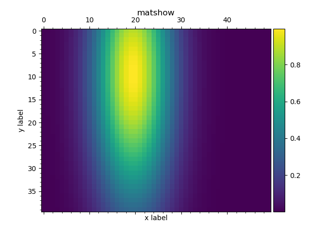
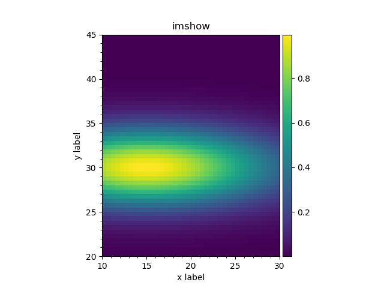
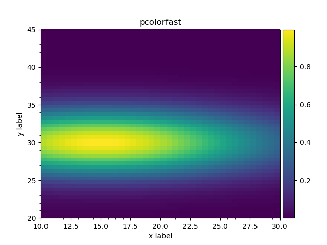
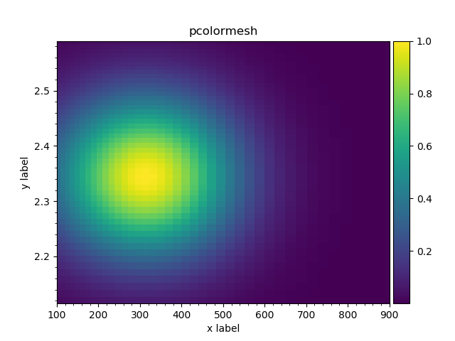

Plotting outputs via matplotlib 2d: 2d histograms
^^^^^^^^^^^^^^^^^^^^^^^^^^^^^^^^^^^^^^^^^^^^^^^^^

Matrices
""""""""

The
A ``plot_matshow(...)`` method is defined implementing
`matshow(A, ...) <https://matplotlib.org/api/pyplot_api.html#matplotlib.pyplot.matshow>`_ call passing output contents as `A`.
This method works with both histograms and arrays. When applied to histograms it ignores bin edges definitions and plots
the matrix anyway.

.. literalinclude:: ../../../macro/tutorial/basic/06_matshow.py
    :linenos:
    :lines: 4-25,31
    :emphasize-lines: 21
    :caption: :download:`06_matshow.py <../../../macro/tutorial/basic/06_matshow.py>`

.. figure:: ../../img/tutorial/06_matshow.png

    A example ``output2d.plot_matshow()`` method for outputs.

.. table:: Keyword options

    +----------------------+------------------------------------------------------------------------------------------------------------------------------+
    | `colorbar=True`      | add a colorbar                                                                                                               |
    +----------------------+------------------------------------------------------------------------------------------------------------------------------+
    | `colorbar=dict(...)` | add a colorbar and pass the options to `colorbar() <https://matplotlib.org/api/pyplot_api.html#matplotlib.pyplot.colorbar>`_ |
    +----------------------+------------------------------------------------------------------------------------------------------------------------------+
    | `mask`               | do not colorize values, equal to `mask`. `mask=0.0` will produce ROOT-like colormaps                                         |
    +----------------------+------------------------------------------------------------------------------------------------------------------------------+
    | `transpose=True`     | transpose arrays before plotting                                                                                             |
    +----------------------+------------------------------------------------------------------------------------------------------------------------------+

.. note::

    Unlike in matplotlib ``output.matshow()`` will not create extra figure by default. See `fignum` option description
    in `matshow() <https://matplotlib.org/api/pyplot_api.html#matplotlib.pyplot.matshow>`_ documentation.

2d histograms with constant binning
"""""""""""""""""""""""""""""""""""

.. literalinclude:: ../../../macro/tutorial/basic/09_hist2d_plot_equal.py
    :linenos:
    :caption: :download:`09_hist2d_plot_equal.py <../../../macro/tutorial/basic/09_hist2d_plot_equal.py>`

   Histogram as matrix.

   Histogram as image.

   Histogram.

2d histograms with variable binning
"""""""""""""""""""""""""""""""""""

.. literalinclude:: ../../../macro/tutorial/basic/09_hist2d_plot.py
    :linenos:
    :caption: :download:`09_hist2d_plot.py <../../../macro/tutorial/basic/09_hist2d_plot.py>`

   Histogram with variable binning.

