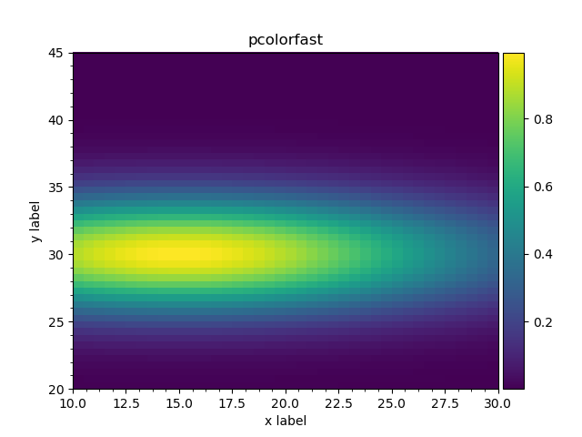

Plotting outputs in 2d: 2d histograms
"""""""""""""""""""""""""""""""""""""

.. _matplotlib_matrices:

Matrices
''''''''

The ``plot_matshow(...)`` method is defined implementing
`matshow(A, ...) <https://matplotlib.org/api/pyplot_api.html#matplotlib.pyplot.matshow>`_ call passing output contents as `A`.
This method works with both histograms and arrays. When applied to histograms it ignores bin edges definitions and plots
the matrix anyway: first dimension defines rows, second - columns; the rows are plotted over Y axis and columns of X
axis.

.. literalinclude:: ../../../macro/tutorial/plotting/03_matshow.py
    :linenos:
    :lines: 4-26,29
    :emphasize-lines: 22
    :caption: :download:`03_matshow.py <../../../macro/tutorial/plotting/03_matshow.py>`

    An example ``output2d.plot_matshow()`` method for outputs.

.. _matplotlib_matrices_options:

.. table:: Keyword options

    +----------------------+------------------------------------------------------------------------------------------------------------------------------+
    | `colorbar=True`      | add a colorbar                                                                                                               |
    +----------------------+------------------------------------------------------------------------------------------------------------------------------+
    | `colorbar=dict(...)` | add a colorbar and pass the options to `colorbar() <https://matplotlib.org/api/pyplot_api.html#matplotlib.pyplot.colorbar>`_ |
    +----------------------+------------------------------------------------------------------------------------------------------------------------------+
    | `mask`               | do not colorize values, equal to `mask`. `mask=0.0` will produce ROOT-like colormaps                                         |
    +----------------------+------------------------------------------------------------------------------------------------------------------------------+
    | `transpose=True`     | transpose arrays before plotting                                                                                             |
    +----------------------+------------------------------------------------------------------------------------------------------------------------------+

.. note::

    Unlike in matplotlib ``output.matshow()`` will not create extra figure by default. See `fignum` option description
    in `matshow() <https://matplotlib.org/api/pyplot_api.html#matplotlib.pyplot.matshow>`_ documentation.

2d histograms with constant binning
'''''''''''''''''''''''''''''''''''

There are several options to plot 2d histograms as histograms, i.e. with first dimension over X and second dimension
over Y. In case the histogram has bins of equal width ``plot_pcolorfast()`` or ``plot_imshow()`` may be used. Both
methods support the same extra options as :ref:`matshow <matplotlib_matrices_options>`.

pcolorfast
++++++++++

``plot_pcolorfast(...)`` method implements a
`pcolorfast(X, Y, C, ...) <https://matplotlib.org/api/_as_gen/matplotlib.axes.Axes.pcolorfast.html?highlight=pcolorfast#matplotlib.axes.Axes.pcolorfast>`_ 
call passing output contents as `X`, `Y` and `C`. Below see an example of Gaussian with width 10 for X and width 3 for
Y.

.. literalinclude:: ../../../macro/tutorial/plotting/06_hist2d_plot_equal.py
    :linenos:
    :lines: 4-24,29-37,62
    :emphasize-lines: 29
    :caption: :download:`06_hist2d_plot_equal.py <../../../macro/tutorial/plotting/06_hist2d_plot_equal.py>`

    2d histogram plotted via ``plot_pcolorfast()`` method.

imshow
++++++

The second method ``plot_imshow()`` is using
`imshow(X, ...) <https://matplotlib.org/api/pyplot_api.html#matplotlib.pyplot.imshow>`_ passing output data as `X`. The
``imshow()`` method is designed to show images and thus it sets the equal visual size for `x` and `y` intervals [#]_.

.. literalinclude:: ../../../macro/tutorial/plotting/06_hist2d_plot_equal.py
    :linenos:
    :lines: 47
    :caption: :download:`06_hist2d_plot_equal.py <../../../macro/tutorial/plotting/06_hist2d_plot_equal.py>`

   2d histogram plotted via ``plot_imshow()`` method.

.. [#] Similar effect may be achieved to any plot with ``ax.set_aspect('equal')``.

matshow
+++++++

The relevant plot, produced by the ``plot_matshow()`` may be found below.

.. literalinclude:: ../../../macro/tutorial/plotting/06_hist2d_plot_equal.py
    :linenos:
    :lines: 58
    :caption: :download:`06_hist2d_plot_equal.py <../../../macro/tutorial/plotting/06_hist2d_plot_equal.py>`

   2d histogram, plotted as matrix.

.. _matplotlib_hist2d_var:

2d histograms with variable binning
'''''''''''''''''''''''''''''''''''

In case histograms have bins of variable size ``plot_pcolormesh()`` method should be used. It is using
`pcolormesh(X, Y, C, ...) <https://matplotlib.org/api/pyplot_api.html#matplotlib.pyplot.pcolormesh>`_ call passing
output data as `X`, `Y` and `C`. The method essentially works for the constant binning histograms as well.
The method supports the same extra options as :ref:`matshow <matplotlib_matrices_options>`.

We will use a Gaussian with width 150 for X and 0.1 for Y.

.. literalinclude:: ../../../macro/tutorial/plotting/06_hist2d_plot.py
   :linenos:
   :lines: 4-24,29-37,51
   :emphasize-lines: 29
   :caption: :download:`06_hist2d_plot.py <../../../macro/tutorial/plotting/06_hist2d_plot.py>`

   2d histogram with variable binning.

