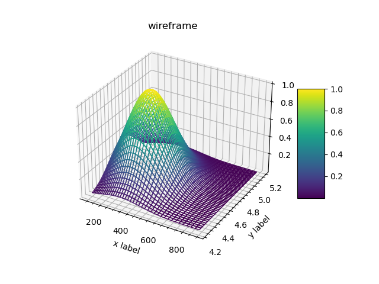

Plotting outputs in 3d: 2d histograms
"""""""""""""""""""""""""""""""""""""

2d histograms
'''''''''''''

2d histograms as in :ref:`example <matplotlib_hist2d_var>` may be plotted in 3d. Three methods are provided for this
purpose. All the methods support the same extra options as :ref:`matshow <matplotlib_matrices_options>`.

Surface
+++++++

The method ``plot_surface`` is using
`plot_surface(X, Y, Z, ...) <https://matplotlib.org/api/_as_gen/mpl_toolkits.mplot3d.axes3d.Axes3D.html?highlight=plot_surface#mpl_toolkits.mplot3d.axes3d.Axes3D.plot_surface>`_ 
matplotlib function passing output data as `X`, `Y` and `Z`. 

.. literalinclude:: ../../../macro/tutorial/plotting/06_hist2d_plot3d.py
   :linenos:
   :lines: 4-39,60
   :emphasize-lines: 22,25,31
   :caption: :download:`06_hist2d_plot3d.py <../../../macro/tutorial/plotting/06_hist2d_plot3d.py>`

In order the surface was colorized ``cmap`` option should be passed with a valid colormap name (use `viridis`).

.. figure:: ../../img/tutorial/plotting/06_hist2d_plot3d_surface.png
   :align: center

   2d histogram, plotted via ``plot_surface()`` method.

.. note::

    Note that ``mplot3d`` toolkit should be used (line 20) and the ``projection='3d'`` option should be set for a
    subplot (line 23).

3d bars
+++++++

The method ``plot_bar3d`` is using
`bar3d(X, Y, Z, dX, dY, dZ, ...) <https://matplotlib.org/api/_as_gen/mpl_toolkits.mplot3d.axes3d.Axes3D.html?highlight=bar3d#mpl_toolkits.mplot3d.axes3d.Axes3D.bar3d>`_ 
matplotlib function passing output data as `X`, `Y`, `Z`, `dX`, `dY`, `dZ`. 

By default the bars are not colorized: ``cmap=True`` may be used to colorize the bars with default colormap.

.. literalinclude:: ../../../macro/tutorial/plotting/06_hist2d_plot3d.py
   :linenos:
   :lines: 45
   :caption: :download:`06_hist2d_plot3d.py <../../../macro/tutorial/plotting/06_hist2d_plot3d.py>`

   2d histogram, plotted via ``plot_bar3d()`` method.

Wireframe
+++++++++

The method ``plot_wireframe`` is using
`plot_wireframe(X, Y, Z, ...) <https://matplotlib.org/api/_as_gen/mpl_toolkits.mplot3d.axes3d.Axes3D.html?highlight=plot_wireframe#mpl_toolkits.mplot3d.axes3d.Axes3D.plot_wireframe>`_ 
matplotlib function passing output data as `X`, `Y`, and `Z`.

By default wire frame is not colorized: ``cmap=True`` may be used to colorize the wires with default colormap.

.. literalinclude:: ../../../macro/tutorial/plotting/06_hist2d_plot3d.py
   :linenos:
   :lines: 56
   :caption: :download:`06_hist2d_plot3d.py <../../../macro/tutorial/plotting/06_hist2d_plot3d.py>`

   2d histogram, plotted via ``plot_wireframe()`` method.

