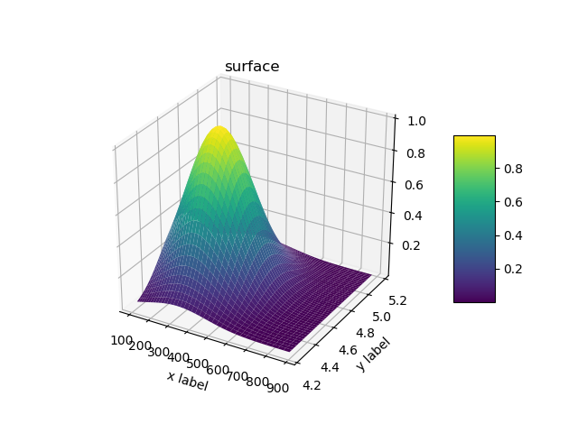
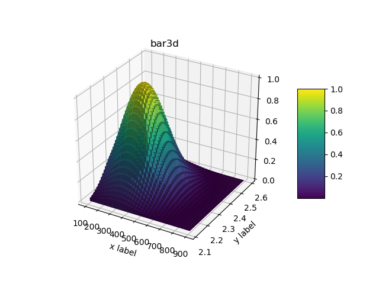
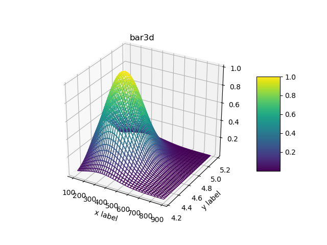

Plotting outputs via matplotlib 3d: 2d histograms
^^^^^^^^^^^^^^^^^^^^^^^^^^^^^^^^^^^^^^^^^^^^^^^^^

2d histograms
"""""""""""""

.. literalinclude:: ../../../macro/tutorial/basic/09_hist2d_plot3d.py
    :linenos:
    :caption: :download:`09_hist2d_plot3d.py <../../../macro/tutorial/basic/09_hist2d_plot3d.py>`

   Surface plot.

   3d bar plot.

   Wireframe plot.
