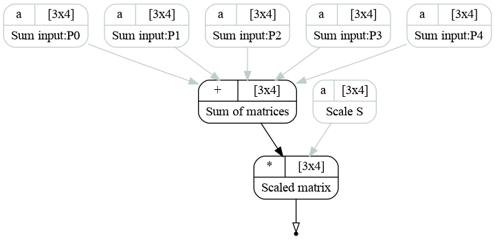

Plotting the graph structure
^^^^^^^^^^^^^^^^^^^^^^^^^^^^

GNA is equipped with a module, that dumps the graph structure to the `graphviz`_ format. The computational graphs are
therefore may be plotted with ``dot`` command. In order to be used, a python module `pygraphviz`_ should be installed.

The computational graph may be plotted with ``savegraph`` function provided within ``gna.graphviz`` module. See the
usage example in the following macro:

.. literalinclude:: ../../../macro/tutorial/plotting/07_graphviz.py
    :linenos:
    :lines: 4-
    :emphasize-lines: 13-18,39-41
    :caption: :download:`07_graphviz.py <../../../macro/tutorial/plotting/07_graphviz.py>`

Here we are using an example, similar to the one in the :ref:`Sum tutorial <tutorial_sum>`. It implements the following
formula:

.. math::

    R_{ij} = S_{ij} \sum_{k=1}^5 P_{ij}^k.

Five matrices :math:`P` are added together within ``Sum`` transformation. The result is then scaled by ``Product``
transformation. The corresponding graph may be found below.

    Example computational graph representing :math:`R_{ij} = S_{ij} \sum\limits_{k=1}^5 P_k`.

Let us now look at how the graph is done. First of all proper labels should be introduced for nodes (transformations)
and, optionally, edges (inputs and outputs). This is done by the method ``setLabel(label)``. First of all it is applied
to each :math:`P_k`:

.. literalinclude:: ../../../macro/tutorial/plotting/07_graphviz.py
    :lines: 16-17

The label may contain multiple lines. Here we used python format_ function (see `pyformat.info`_ for tutorial). Then we
add labels for the sum, product and scale:

.. literalinclude:: ../../../macro/tutorial/plotting/07_graphviz.py
    :lines: 18-20

Finally, we add label for the output:

.. literalinclude:: ../../../macro/tutorial/plotting/07_graphviz.py
    :lines: 21

Now, there is enough information to plot the graph with ``savegraph(transformation, filename)`` function:

.. literalinclude:: ../../../macro/tutorial/plotting/07_graphviz.py
    :lines: 42-44

The first argument is transformation, output or list of transformations and outputs. The file format is either `.dot`,
or an image format (`.png`, `.pdf`). 

Optional argument `rankdir` defines the graph growth direction: 'TB' for top to bottom and 'LR' for left to right.

While the images are ready to use, the dot file may be opened with `dot`/`xdot` [#]_ applications:

.. code-block:: bash

   xdot output/07_graphviz.dot

The `.dot` file is readable and may be edited by the user.

.. _graphviz: http://www.graphviz.org
.. _pygraphviz: https://pygraphviz.github.io
.. _format: https://pyformat.info
.. _`pyformat.info`: https://pyformat.info
.. [#] `xdot` should be installed additionally.

