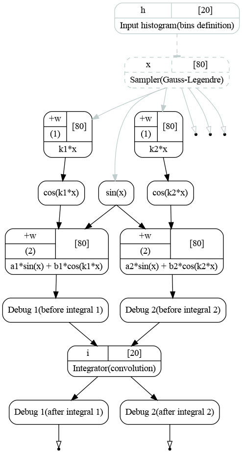

.. _tutorial_topology:

Lazy evaluation and graph structure
'''''''''''''''''''''''''''''''''''

Introduction
++++++++++++

In this section we will take a closer look on taintflag propagation and on how the graph is evaluated. We will look at
two examples. Each example defines integrals of two functions:

.. math::
   :label: graph_structure_functions

   f_1(x) = a_1 \sin(x) + b_1 \cos(k_1 x),\\
   f_2(x) = a_2 \sin(x) + b_2 \cos(k_1 x).

The functions depend on different parameters. The only difference between examples is that first one does integration
with two distinct transformations while the second reuses a single transformation to integrate both functions.
Examples are based on the code from tutorials :ref:`tutorial_integration` and :ref:`tutorial_integration_again`.

Example 1: separate transformations
+++++++++++++++++++++++++++++++++++

The first example goes as follows:

.. literalinclude:: ../../../macro/tutorial/complex/04_graph_topology_a.py
    :linenos:
    :lines: 4-
    :emphasize-lines: 51-52, 55-58, 68-71
    :caption: :download:`04_graph_topology_a.py <../../../macro/tutorial/complex/04_graph_topology_a.py>`

It produces the following graph.

    Computatinal graph used to compute integrals of functions :eq:`graph_structure_functions`. Each integration is
    handled by distinct integrator.

As before the procedure starts from the bins and integration points definition. The integration points then go to the
transformation implementing :math:`sin(x)` which is same for both functions. Cosines are computed in separate branches.
The functions and integrations are then done in separate branches as well.

Note there are 4 debug transformations before and after each integration. Debug transformations print to the terminal,
when the transformation their functions are executed. This will help us track the procedure of graph execution.

They are created with the following commands:

.. literalinclude:: ../../../macro/tutorial/complex/04_graph_topology_a.py
    :lines: 58-61

The first argument defines the name which will be printed to the output, the second argument is a delay :math:`D`. The
transformation function will sleep for :math:`D` seconds if executed. The debug transformation has the same number of
outputs as the number of inputs. Its input is directly copied to the corresponding output.

The integrators are created with the following lines:

.. literalinclude:: ../../../macro/tutorial/complex/04_graph_topology_a.py
    :linenos:
    :lines: 71-74

At first we simply save the first integrator for later use (labels and binding). Then we bind the output of first debug
transformation to the input of the integrator via `add_input(output)` method. The second instance of the integrator is
created with `add_transformation()` method. The second integrand is again added with the `add_input(output)` method.

The status of the integrator object confirms that we have created two integrator instances (`hist` and `hist_02`) and
each of them has an input bound to the output of the function (through the debug transformation).

.. code-block:: text

    [obj] IntegratorGL: 3 transformation(s), 0 variables
     0 [trans] points: 1 input(s), 2 output(s)
         0 [in]  edges <- [out] hist: hist,  20 bins, edges -3.14159265359->3.14159265359, width 0.314159265359
         0 [out] x: array 1d, shape 80, size  80
         1 [out] xedges: hist,  21 bins, edges -3.14159265359->3.14159265359, width 0.314159265359
     1 [trans] hist: 1 input(s), 1 output(s)
         0 [in]  f <- [out] target: array 1d, shape 80, size  80
         0 [out] hist: hist,  20 bins, edges -3.14159265359->3.14159265359, width 0.314159265359
     2 [trans] hist_02: 1 input(s), 1 output(s)
         0 [in]  f <- [out] target: array 1d, shape 80, size  80
         0 [out] hist: hist,  20 bins, edges -3.14159265359->3.14159265359, width 0.314159265359

After the computational graph is constructed let us access the output of each last transformation twice:

.. literalinclude:: ../../../macro/tutorial/complex/04_graph_topology_a.py
    :lines: 85,89,94,98

Here is the corresponding terminal output:

.. code-block:: text

    Read data 1: 1st
        debug: executing transformation function (#1) [before int1]
        debug: sleep for 1 second(s)... done. [before int1]
        debug: executing transformation function (#1) [after int1]
        debug: sleep for 1 second(s)... done. [after int1]

    Read data 1: 2d
        <no functions executed>

    Read data 2d 1st
        debug: executing transformation function (#1) [before int2]
        debug: sleep for 1 second(s)... done. [before int2]
        debug: executing transformation function (#1) [after int2]
        debug: sleep for 1 second(s)... done. [after int2]

    Read data 2d 2d
        <no functions executed>

As we read the output of the first branch, it triggers the execution of the transformations needed for this branch only.
As one can see, no debug output associated with second integral happens after first data access. On the second data
access to the same branch no execution happens: the transformation simply returns the cached result.

Only when the output of the second branch is read, the remaining transformations are triggered. Again, on the second
access no execution happens.

Next we change the value of :math:`k_1` coefficient, that affects the branch 1 via cosine:

.. literalinclude:: ../../../macro/tutorial/complex/04_graph_topology_a.py
    :lines: 104

and repeat the procedure of reading data from both branches twice. Here is the result:

.. code-block:: text

    Read data 1: 1st
        debug: executing transformation function (#2) [before int1]
        debug: sleep for 1 second(s)... done. [before int1]
        debug: executing transformation function (#2) [after int1]
        debug: sleep for 1 second(s)... done. [after int1]

    Read data 1: 2d
        <no functions executed>

    Read data 2d 1st
        <no functions executed>

    Read data 2d 2d
        <no functions executed>

As one can see, only the first branch integral was triggered. The second branch returned the cached value as it is not
affected by :math:`k_1`.

.. note::

    The actual execution happens only when data is read, but not by the change of the value of :math:`k_1`.

Example 2: merged transformations
+++++++++++++++++++++++++++++++++

The code for the second example is mostly identical to the previous one so we only highlight the part that is different:

.. literalinclude:: ../../../macro/tutorial/complex/04_graph_topology_b.py
    :linenos:
    :lines: 71-73
    :caption: :download:`04_graph_topology_b.py <../../../macro/tutorial/complex/04_graph_topology_b.py>`

These lines represent the binding of the integrator inputs. As we do not create the second integration here, both
`add_input(output)` calls bind the outputs to the same integrator.

.. code-block:: text

    [obj] IntegratorGL: 2 transformation(s), 0 variables
     0 [trans] points: 1 input(s), 2 output(s)
         0 [in]  edges <- [out] hist: hist,  20 bins, edges -3.14159265359->3.14159265359, width 0.314159265359
         0 [out] x: array 1d, shape 80, size  80
         1 [out] xedges: hist,  21 bins, edges -3.14159265359->3.14159265359, width 0.314159265359
     1 [trans] hist: 2 input(s), 2 output(s)
         0 [in]  f <- [out] target: array 1d, shape 80, size  80
         1 [in]  f_02 <- [out] target: array 1d, shape 80, size  80
         0 [out] hist: hist,  20 bins, edges -3.14159265359->3.14159265359, width 0.314159265359
         1 [out] hist_02: hist,  20 bins, edges -3.14159265359->3.14159265359, width 0.314159265359

The graph looks as follows [#]_.

    Computatinal graph used to compute integrals of functions :eq:`graph_structure_functions`. Both integrations are
    handled by a single transformation.

We now repeat the procedure of accessing the data outputs.

.. code-block:: text

    Read data 1: 1st
        debug: executing transformation function (#1) [before int1]
        debug: sleep for 1 second(s)... done. [before int1]
        debug: executing transformation function (#1) [before int2]
        debug: sleep for 1 second(s)... done. [before int2]
        debug: executing transformation function (#1) [after int1]
        debug: sleep for 1 second(s)... done. [after int1]

    Read data 1: 2d
        <no functions executed>

    Read data 2d 1st
        debug: executing transformation function (#1) [after int2]
        debug: sleep for 1 second(s)... done. [after int2]

    Read data 2d 2d
        <no functions executed>

As one can see, since the integrator is reading all its inputs, both branches before the integrator are triggered on the
first data access. The last debug in the second branch is not executed since it is not required for the first branch. It
is then executed, when the second branch is accessed.

Absolutely the same thing happens after we change the value of the coefficient :math:`k_1`.

.. code-block:: text

    Read data 1: 1st
        debug: executing transformation function (#2) [before int1]
        debug: sleep for 1 second(s)... done. [before int1]
        debug: executing transformation function (#2) [after int1]
        debug: sleep for 1 second(s)... done. [after int1]

    Read data 1: 2d
        <no functions executed>

    Read data 2d 1st
        debug: executing transformation function (#2) [after int2]
        debug: sleep for 1 second(s)... done. [after int2]

    Read data 2d 2d
        <no functions executed>

The integrator execution is triggered by the data access after the :math:`k_1` is changed. Integrator then will
integrate the branch 2 regardless of was it tainted or not.

.. [#] The fact that branches before and after integration appear to be flipped on the figure is due to graphviz not
        keeping left-to-right order of the nodes, but not due to bug in GNA.

Conclusions
+++++++++++

The two presented graph structures produce the same numerical result but do differ in terms of execution order and
efficiency:

  #. Having separate transformations for each operation provides very good granularity. Such a cases will be efficient
     when there are a lot of parameters and the parameters are changed one at a time making a good use of caching and
     lazy evaluation.
  #. Merging *a lot* of transformations together is potentially efficient in cases, when the overhead of function
     execution itself is more important then the impact of granularity and the array sizes, i.e. for usage on GPUs. In
     this case it may happen to be more efficient to compute a lot of branches in the same call than taking care on
     which of them are required to be recalculated.

As soon as we are planning to provide the GPU support we will take care on changing the graph structure. Most of the
objects will be provided with methods similar `add_transformation()` and `add_input()` and ability to switch between
one-transformation/multiple-inputs and single-input/multiple-transformations strategies.

