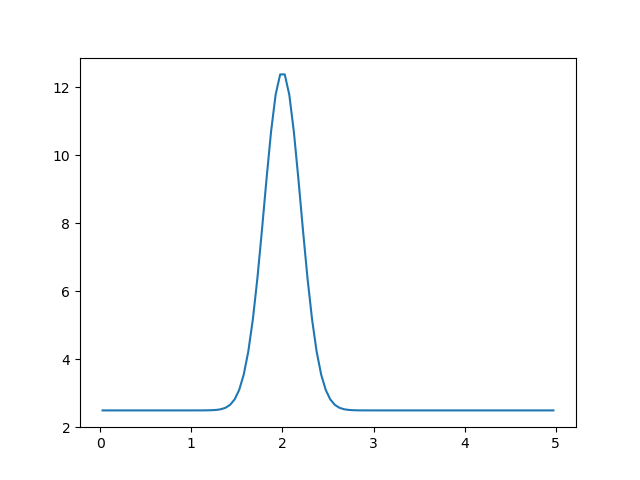
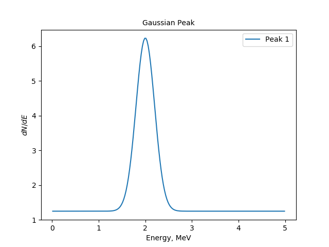
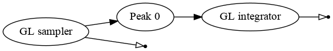
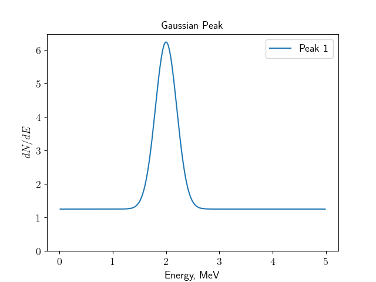
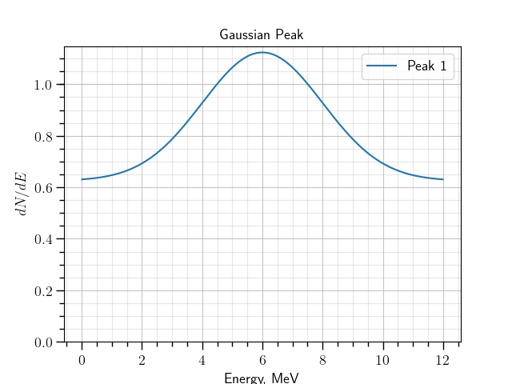

Example: initializing and plotting a model
""""""""""""""""""""""""""""""""""""""""""

Creating and plotting a model
'''''''''''''''''''''''''''''

Let us now use `gaussianpeak` module to create a simple module with integrated Gaussian function. The command

.. code-block:: bash

    ./gna -- \
          -- gaussianpeak --name peak

Creates a computational chain with integration and registers the output in the environment as `peak/spectrum`. This is
registered in the output as:

.. code-block:: text

    Add observable: peak/spectrum

This output now may be used from the other modules. For example, we may plot it with `plot-spectrum` module.

We will use multi-line commands for better readability. Note, that `\\` at the end of each line should have no spaces afterwards.

  .. `` this line is needed to trick editor's syntax highlighting

.. code-block:: bash

    ./gna -- \
          -- gaussianpeak --name peak \
          -- plot-spectrum -p peak/spectrum \
          -- mpl -s

The module `plot-spectrum` adds the output to the figure after `-p <name>` option. Argument `-s` enables `plot-spectrum`
to show the window with plotted figure after execution. The command will produce the following plot.

    The spectrum, created by the `gaussianpeak` module and plotted via `plot-spectrum` module.

Both modules have options, that enable us to control the parameters. Let us define the energy range and number of bins
(see `./gna -- gaussianpeak --help` for reference). Also let us define the figure title and axes labels
(see `./gna -- plot-spectrum --help` for reference):

.. code-block:: bash

    ./gna -- \
          -- gaussianpeak --name peak --Emin 0 --Emax 5 --nbins 200 \
          -- plot-spectrum -p peak/spectrum -l 'Peak 1' \
          -- mpl -t 'Gaussian Peak' --xlabel 'Energy, MeV' --ylabel '$dN/dE$' -s

The modified command produces now annotated plot:

    The spectrum, created by the `gaussianpeak` module and plotted via `plot-spectrum` module.

Finally, let us save the image using `-o <filename.pdf>` option. With use :code:`--latex` command to enable `matplotlib` use
latex for better rendering.

Also let us save the graph of the example model. The `graphviz` module reads the output name as the first argument.

.. code-block:: bash

  ./gna -- \
        -- gaussianpeak --name peak --Emin 0 --Emax 5 --nbins 200 --print \
        -- graphviz peak/spectrum -o output/gna_ui_graph.pdf \
        -- plot_spectrum -p peak/spectrum -l 'Peak 1' \
        -- mpl --ylim 0.0 -t 'Gaussian Peak' \
               --xlabel 'Energy, MeV' --ylabel '$dN/dE$' \
               -s --latex -o output/gna_ui_figure.pdf

The model is represented by the following graph:

   The computational chain created by the `gaussianpeak` module.

The chain consists of a single GuaissianPeak transformation, implementing a sum of a normal distribution and flat
background. The function is integrated with Gauss-Legendre integrator.

    The spectrum, created by the `gaussianpeak` module.

.. note::

    Do not forget to create `output` folder.

Changing the parameter values
'''''''''''''''''''''''''''''

Remember, that parameters are not owned neither by transformations, nor by the modules the transformations are created
in. The parameters are usually initialized with `reqparameter()` command which only creates anything when no parameters
with the same name was defined before.

The module `gaussianpeak` also prints a list of the variables it creates, when argument :code:`--print` is passed:

.. code-block:: text

  Variables in namespace 'peak':
  BackgroundRate       =         50 │          50±           5 [         10%] │ Flat background rate 0
  Mu                   =        100 │         100±          10 [         10%] │ Peak 0 amplitude
  E0                   =          2 │           2±        0.05 [        2.5%] │ Peak 0 position
  Width                =        0.2 │         0.2±       0.005 [        2.5%] │ Peak 0 width

They are the contribution of the flat background and the parameters of the peak: position, width and amplitude, defined
as follows:

.. math::

    \frac{d N}{d E} = b + \mu \frac{1}{\sqrt{2\pi w}}\exp{\frac{-(E-E_0)^2}{2w^2}}

All of these parameters may be overridden from the command line via `ns` module. As usual the help may be requested via
 :code:`./gna -- ns --help` command. Main `ns` commands include:

.. code-block:: bash

   ./gna -- ns --print \
       --define var1    central=1 fixed=True label='Fixed variable' \
       --define var2    central=2 sigma=0.5  label='Constrained variable' \
       --define ns.var3 central=3 free=True label='Free nested variable'

The syntax is similar to that described in :ref:`tutorial <tutorial_parameters_def>` on parameters. The :code::code:`--print`
argument makes `ns` print the global namespace.

.. code-block:: text

   Variables in namespace '':
     var1                 =          1 │                 [fixed]                 │ Fixed variable
     var2                 =          2 │           2±         0.5 [         25%] │ Constrained variable
   Variables in namespace 'ns':
     var3                 =          3 │           3±         inf [free]         │ Free nested variable

A namespace name may follow the :code:`--print` argument. Thus :code:`--print ns` will print only  the last parameter.

Now by using `ns` module we may tune the parameters for the `gaussianpeak` model. As one may see from the printout
above, the `gaussianpeak` parameters are defined in the namespace `peak`. Therefore, we may predefine them.

The following command line lower the background rate twice, moves the peak position to 6 (MeV) and changes its width to
2 MeV. We also increase the range to 12 MeV as well as the number of bins.

.. code-block:: bash

  ./gna -- ns \
              --define peak.BackgroundRate central=25  fixed=True label='Background rate' \
              --define peak.E0             central=6   fixed=True label='Peak position' \
              --define peak.Width          central=2   fixed=True label='Peak width' \
        -- gaussianpeak --name peak --Emin 0 --Emax 12 --nbins 480 --print \
        -- plot_spectrum -p peak/spectrum -l 'Peak 1' \
        -- mpl --ylim 0.0 -t 'Gaussian Peak' \
               --xlabel 'Energy, MeV' --ylabel '$dN/dE$' \
               -s

The command produces the following plot:

    The spectrum, created by the `gaussianpeak` module with modified parameters.
