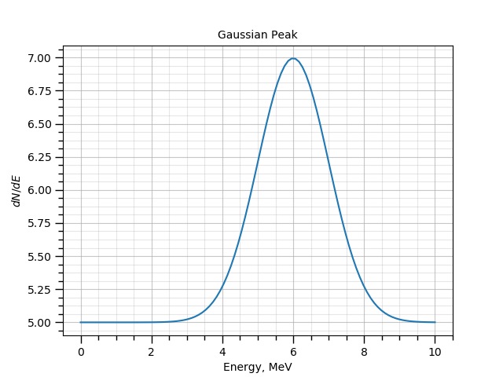

Introducing new experiments
"""""""""""""""""""""""""""

From the point of view of GNA command line user interface and experiment is just an UI module, that announces the
outputs within common environment. In order to separate the experiments from regular UI modules they are loaded via a
dedicated UI module `exp`:

.. code-block:: bash

    ./gna -- exp --help

The experiment implementations are expected to be located in on of the `experimentpaths`, defined in
`config/gna/gnacfg.py` file. The default configuration may be overridden, see the `experimentpaths` example from
:ref:`bundles <bundles_configuration>` tutorial.

Let us now use the tutorial path for our `experimentpaths` and define a new experiment.

.. code-block:: bash

    mkdir -p config_local/gna
    echo "experimentpaths = ['./macro/tutorial/ui/experiments']" >> config_local/gna/gnacfg.py

The command :code:`./gna -- exp -L` will now print the list of available experiments:

.. code-block:: text

   Loading config file: config/gna/gnacfg.py
   Loading config file: config_local/gna/gnacfg.py
   Search paths:  ./macro/tutorial/ui/experiments
   UI exp list of experiments:
       exampleexp

As one can see from the output, GNA has read the user configuration file. The path to search for the experiments points
to the tutorial and there is only one experiment defined: `exampleexp`. This corresponds to the file
`./macro/tutorial/ui/experiments/exampleexp.py`.

We will now introduce a simple model, similar to `gaussianpeak`, but simpler. The model will contain flat background and
a single Gaussian peak without integration. We will not define the default values for parameters, therefore they are
expected to be provided from the command line.

Here is the code:

.. literalinclude:: ../../../macro/tutorial/ui/experiments/exampleexp.py
    :linenos:
    :lines: 2-
    :caption: :download:`exampleexp.py <../../../macro/tutorial/ui/experiments/exampleexp.py>`

Let us go through it method by method. First of all, the experiment definition should contain a class `exp` that
inherits from `gna.exp.baseexp`. Class initializer has two arguments local namespace and command line options:

.. literalinclude:: ../../../macro/tutorial/ui/experiments/exampleexp.py
    :linenos:
    :lines: 7-13
    :emphasize-lines: 1-3

Both arguments should be passed to the parent class initializer. Afterwards the user may do whatever he wants to define
the experiment. We split this work in two methods: `exp.build()` to build the model and `exp.register()` to register the
outputs in the environment.

The namespace and the options are available as class members `self.namespace` and `self.opts`. Before working on actual
implementation we need to define the command line parsing options.

In order to define the command line parsing behaviour the user must define class method `initparser(parser,namespace)`.

.. literalinclude:: ../../../macro/tutorial/ui/experiments/exampleexp.py
    :linenos:
    :lines: 15-19

The `parser` is an instance of the `Argparser <https://docs.python.org/2/howto/argparse.html>`_ python module. See
Argparser `documentation <https://docs.python.org/2/howto/argparse.html>`_ for reference. The basic syntax is quite self
explanatory. Within three lines 3-5 we define:

1. Option :code:`-r` or :code:`--range` expecting two arguments that will be converted to float. The provided value will be available
   as `self.opts.range`. In case nothing is provided the value will be set to `(0.0, 10.0)`.
2. Option :code:`-N` or :code:`--points` expecting one argument that will be converted to integer. The provided value will be available
   as `self.opts.points`. In case nothing is provided the value will be set to `200`.
3. Option :code:`-n` or :code:`--name` expecting one argument (string). The provided value will be available
   as `self.opts.name`. In case nothing is provided the value will be set to `peak`.

The option `range` defines the energy range, `points` defines the number of points over X axis and `name` defines the
observable name.

As soon as proper `help` lines are specified, one may get the documented help with the :code:`./gna -- exp --help exampleexp`
command:

.. code-block:: text

    usage: gna -- exp exampleexp [-h] [-r RANGE RANGE] [-N POINTS] [-n NAME]

    optional arguments:
      -h, --help            show this help message and exit
      -r RANGE RANGE, --range RANGE RANGE
                            Energy range
      -N POINTS, --points POINTS
                            Number of points
      -n NAME, --name NAME  observable name

The actual computational chain is defined in the `build()` method.

.. literalinclude:: ../../../macro/tutorial/ui/experiments/exampleexp.py
    :linenos:
    :lines: 21-30
    :emphasize-lines: 8-10

First half checks that all the necessary variables are present in the namespace. Than we define energy axis as instance
of `Points`. The energy array is then bound to the input of the `GaussianPeakWithBackground` instance. When module `exp`
loads the experiment definition it ensures that `exp.namespace` is set as default namespace to search for parameters.

And the last method adds the outputs as observables to the current namespace: `x` and `peak`:

.. literalinclude:: ../../../macro/tutorial/ui/experiments/exampleexp.py
    :linenos:
    :lines: 32-34

As the namespace is shared across the modules, the observables are accessible for other commands, including
`plot-spectrum`, `minimizer` or `fit`.

Let us now define the parameters and execute the module.

.. code-block:: bash

    ./gna -- ns \
                --define BackgroundRate central=5 fixed=True label='Background rate' \
                --define E0             central=6 fixed=True label='Peak position' \
                --define Width          central=1 fixed=True label='Peak width' \
                --define Mu             central=5 fixed=True label='Signal rate' \
            -- exp exampleexp --range 0 10 -N 100

The command output reflects the fact, that the outputs were registered:

.. code-block:: text

    Add observable: /x
    Add observable: /peak

We now may plot the provided model with `plot-spectrum` module. The only change we do is that we place the variables and
the outputs to the nested namespace `peak`. In order to achieve this we are using :code:`ns --name` and :code:`exp --ns`
options.

Unlike in case of histograms, the output does not contain the information about the X axis, therefore a special option
:code:`--vs`

.. code-block:: bash

    ./gna -- ns --name peak -p \
                    --define BackgroundRate central=5 fixed=True label='Background rate' \
                    --define E0             central=6 fixed=True label='Peak position' \
                    --define Width          central=1 fixed=True label='Peak width' \
                    --define Mu             central=5 fixed=True label='Signal rate' \
              -- exp --ns peak exampleexp --range 0 10 -N 100 \
              -- plot-spectrum -p peak/peak --vs peak/x \
              -- mpl -t 'Gaussian Peak' --xlabel 'Energy, MeV' --ylabel '$dN/dE$' \
                               --grid -s

..
    ./gna -- ns --name peak -p \
                    --define BackgroundRate central=5 fixed=True label='Background rate' \
                    --define E0             central=6 fixed=True label='Peak position' \
                    --define Width          central=1 fixed=True label='Peak width' \
                    --define Mu             central=5 fixed=True label='Signal rate' \
              -- exp --ns peak exampleexp --range 0 10 -N 100 \
              -- plot-spectrum -p peak/peak --vs peak/x \
                               -t 'Gaussian Peak' --xlabel 'Energy, MeV' --ylabel '$dN/dE$' \
                               --grid -o doc/img/tutorial/ui/02_gna_exp_plot.png

The output of the command is:

    The model, defined by the `exampleexp` exp module.

.. important::

    Good practise is to work on your own models and experiments in a restricted environment, i.e. in a separate folder
    added to the `experimentpaths` configuration variable.
