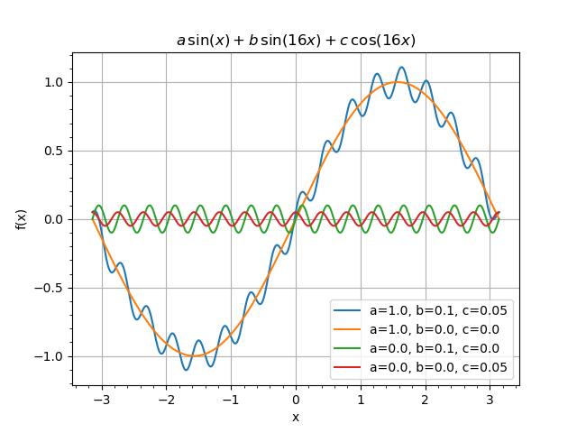

WeightedSum transformation
""""""""""""""""""""""""""

After getting familiar with how variables are defined it is the time to start using them with transformations. The first
transformation we will consider is :ref:`WeightedSum`. ``WeightedSum`` transformation implements the following sum:

.. math::
    S = \sum_{i=1}^{N} \omega_i A_i,

where :math:`A_i` is an array bound to the transformation input :math:`i`, :math:`\omega_i` is a weight bound to the
transformation from the namespace. Let us look at the example:

.. literalinclude:: ../../../macro/tutorial/variables/04_weightedsum.py
    :linenos:
    :lines: 4-63, 66
    :emphasize-lines: 29
    :caption: :download:`04_weightedsum.py <../../../macro/tutorial/variables/04_weightedsum.py>`

The example implements the following formula:

.. math::

   S = a\sin(x)+b\sin(16x)+c\cos(16x),

where :math:`a`, :math:`b` and :math:`c` are variables, initialized as follows:

.. literalinclude:: ../../../macro/tutorial/variables/04_weightedsum.py
    :lines: 15-17

The ``WeightedSum`` constructor is similar to the one for ``Sum`` with the only addition: a list of variables names
should be passed as the first argument:

.. literalinclude:: ../../../macro/tutorial/variables/04_weightedsum.py
    :lines: 31-32

The second argument is either list of outputs or list of names to give to the inputs. In the latter case the inputs
should be bounded to outputs of other transformations manually as it was done in tutorials for transformations
:ref:`tutorial_sum` and :ref:`tutorial_product`.

The contents of the ``WeightedSum`` from the example above is the following:

.. code-block:: text

   [obj] WeightedSum: 1 transformation(s)
        0 [trans] sum: 3 input(s), 1 output(s)
            0 [in]  a -> [out] points: array 1d, shape 500, size 500
            1 [in]  b -> [out] points: array 1d, shape 500, size 500
            2 [in]  c -> [out] points: array 1d, shape 500, size 500
            0 [out] sum: array 1d, shape 500, size 500

   Variables, relative to namespace "":
       a                    =          1 │           1±         inf [free]         │ weight 1
       b                    =        0.1 │         0.1±         inf [free]         │ weight 2
       c                    =       0.05 │        0.05±         inf [free]         │ weight 3

Note, that ``print()`` method now prints the variables on which ``GNAObject`` depends.

After initializing the object we make four plots:

    A set of ``WeightedSum`` plots for different values of the parameters.

First (blue) line corresponds to the initial parameters :math:`a=1.0`, :math:`b=0.1` and :math:`c=0.05`. Then we switch
of fast oscillating components with

.. literalinclude:: ../../../macro/tutorial/variables/04_weightedsum.py
    :lines: 47-48

Here we have used `push(value)` method, that sets the value of the parameter and saves the previous one. The previous
value may then be retrieved by `pop()` method.

The second line (orange) corresponds to the main frequency. Then we disable main frequency and enable the first
secondary frequency by:

.. literalinclude:: ../../../macro/tutorial/variables/04_weightedsum.py
    :lines: 52-53

The green line corresponds to this. The last minor component (red) is plotted after changing the parameters:

.. literalinclude:: ../../../macro/tutorial/variables/04_weightedsum.py
    :lines: 57-58

Working with nested namespaces
""""""""""""""""""""""""""""""

Now let us repeat the example above in a different setting.

.. literalinclude:: ../../../macro/tutorial/variables/05_weightedsum_nested.py
    :linenos:
    :lines: 4-56,59
    :emphasize-lines: 34-35
    :caption: :download:`05_weightedsum_nested.py <../../../macro/tutorial/variables/05_weightedsum_nested.py>`

We define two sets of variables. Parameters :math:`a` and :math:`b` in the global namespace and parameters :math:`a`,
:math:`b` and :math:`c` in namespace `group`.

.. literalinclude:: ../../../macro/tutorial/variables/05_weightedsum_nested.py
    :lines: 15-19

Then we create two instances of ``WeightedSum`` with similar inputs, but depending on different variables. First:

.. literalinclude:: ../../../macro/tutorial/variables/05_weightedsum_nested.py
   :lines: 33-34

depends on variables :math:`a` and :math:`b` from global namespace and variable :math:`c` from namespace `group`. The
dependence is reflected by the output:

.. code-block:: text

   Variables, relative to namespace "":
   a                    =          1 │           1±         inf [free]         │ weight 1 (global)
   b                    =       -0.1 │        -0.1±         inf [free]         │ weight 2 (global)
   c                    =       0.05 │        0.05±         inf [free]         │ weight 3 (local) [group.c]

Note the full path `group.c` printed for the variable :math:`c`.

The second ``WeightedSum`` is created in a nested namespace `group`:

.. literalinclude:: ../../../macro/tutorial/variables/05_weightedsum_nested.py
    :lines: 36-38

Note that since the variables are now taken from the namespace `group` the local path `c` is used for variable
:math:`c`. The switching to the group `group` is done via `with ns('group'):` statement. All the code within the scope
of the `with` statement will work with variables from the namespace `group`.

The printout of the second ``WeightedSum`` now refers to the variables from the `group`:

.. code-block:: text

    Variables, relative to namespace "group":
    a                    =        0.5 │         0.5±         inf [free]         │ weight 1 (local)
    b                    =          0 │           0±         inf [free]         │ weight 2 (local)
    c                    =       0.05 │        0.05±         inf [free]         │ weight 3 (local)

Instances of ``WeightedSum`` depend on different sets of variables. We then plot them with

.. literalinclude:: ../../../macro/tutorial/variables/05_weightedsum_nested.py
    :lines: 52-53

    A set of ``WeightedSum`` plots for different values of the parameters.

To make the legend we have used ``variablevalues()`` method. It returns the dictionary with *short* variable names and
values and can be used within string formatting functions.

.. note::

    ``variablevalues()`` and ``print()`` methods take care only on the variables the transformation depends directly. It
    knows nothing about variables the input transformation depend on.

